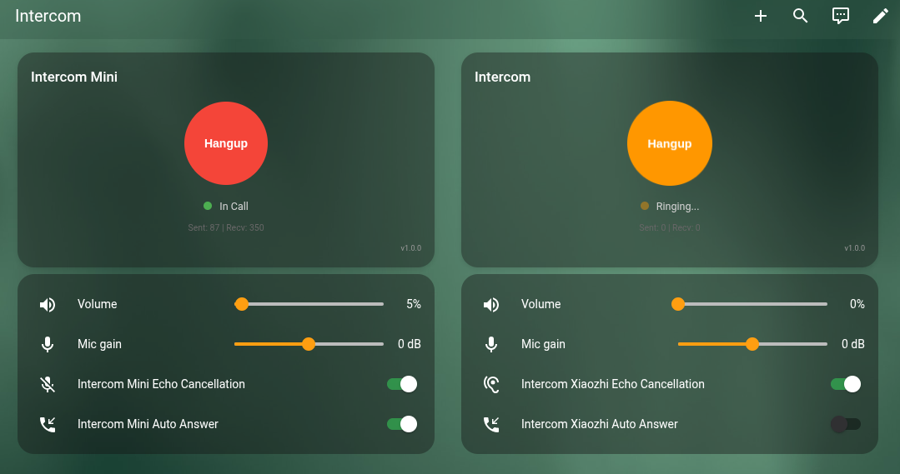
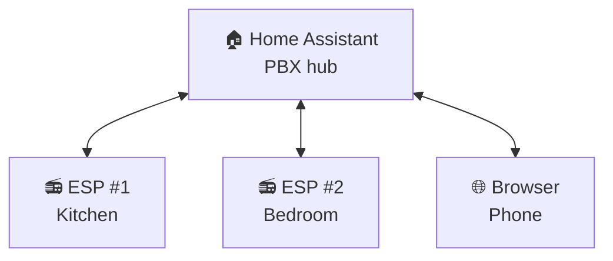
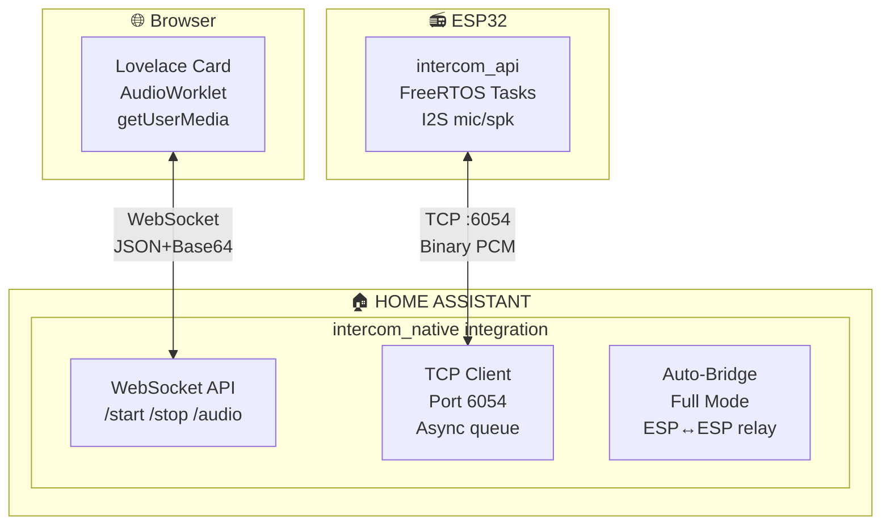
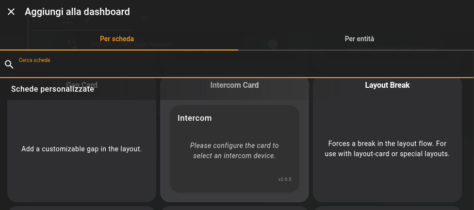
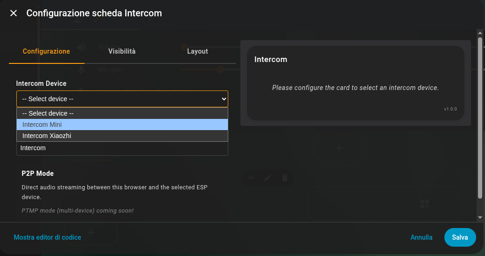
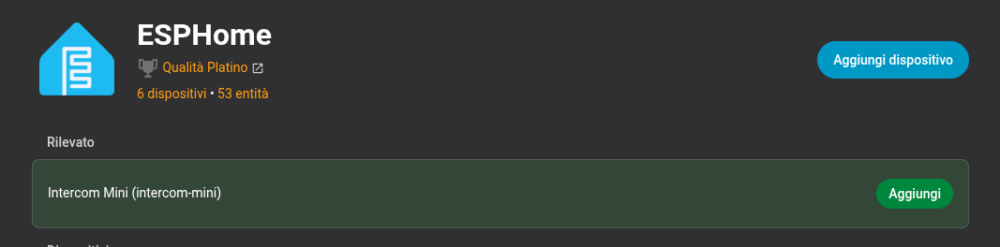
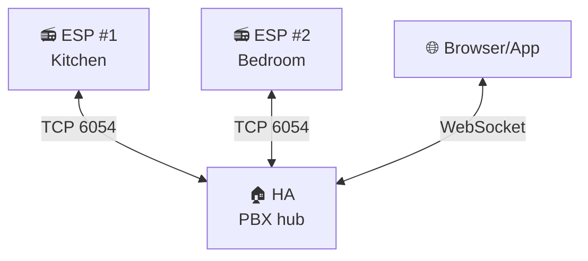
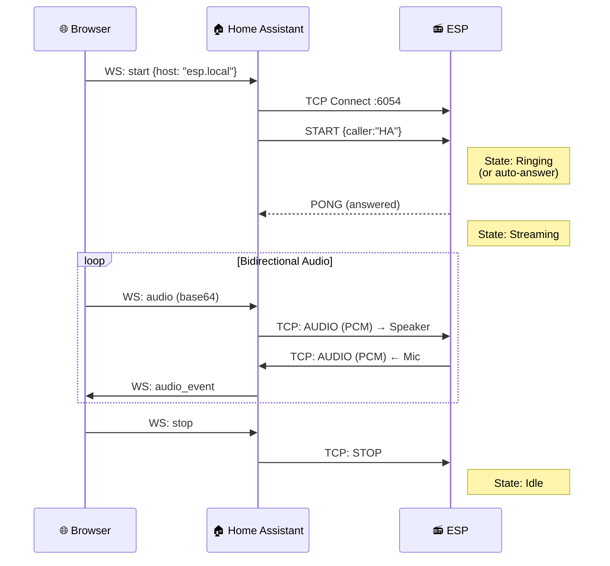
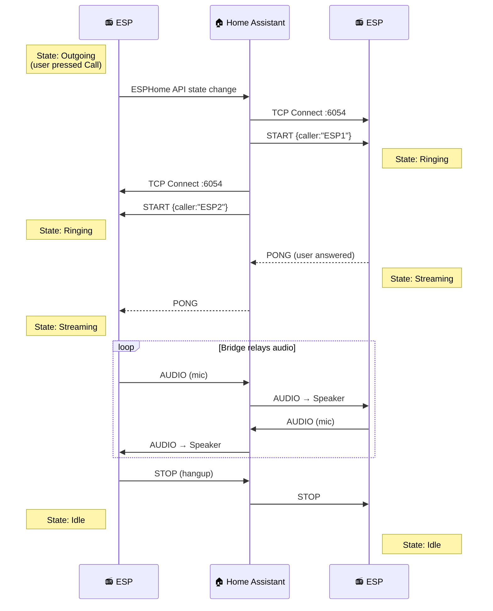

# ESPHome Intercom API

A flexible intercom framework for ESP32 devices - from simple full-duplex doorbell to PBX-like multi-device system.




<table>
  <tr>
    <td align="center"><br/><b>Idle</b></td>
    <td align="center"><br/><b>Calling</b></td>
    <td align="center"><br/><b>Ringing</b></td>
    <td align="center"><br/><b>In Call</b></td>
  </tr>
</table>

## Table of Contents

- [Overview](#overview)
- [Features](#features)
- [Architecture](#architecture)
- [Installation](#installation)
  - [1. Home Assistant Integration](#1-home-assistant-integration)
  - [2. ESPHome Component](#2-esphome-component)
  - [3. Lovelace Card](#3-lovelace-card)
- [Operating Modes](#operating-modes)
  - [Simple Mode](#simple-mode-browser--esp)
  - [Full Mode](#full-mode-esp--esp)
- [Configuration Reference](#configuration-reference)
- [Entities and Controls](#entities-and-controls)
- [Call Flow Diagrams](#call-flow-diagrams)
- [Hardware Support](#hardware-support)
- [Voice Assistant Coexistence & AEC Best Practices](#voice-assistant-coexistence--aec-best-practices)
- [Troubleshooting](#troubleshooting)
- [License](#license)

---

## Overview

**Intercom API** is a scalable full-duplex ESPHome intercom framework that grows with your needs:

| Use Case | Configuration | Description |
|----------|---------------|-------------|
| 🔔 **Simple Doorbell** | 1 ESP + Browser | Ring notification, answer from phone/PC |
| 🏠 **Home Intercom** | Multiple ESPs | Call between rooms (Kitchen ↔ Bedroom) |
| 📞 **PBX-like System** | ESPs + Browser + HA | Full intercom network with Home Assistant as a participant |

**Home Assistant acts as the central hub** - it can receive calls (doorbell), make calls to ESPs, and relay calls between devices. All audio flows through HA, enabling remote access without complex NAT/firewall configuration.



### Why This Project?

This component was born from the limitations of [esphome-intercom](https://github.com/n-IA-hane/esphome-intercom), which uses direct ESP-to-ESP UDP communication. That approach works great for local networks but fails in these scenarios:

- **Remote access**: WebRTC/go2rtc fails through NAT without port forwarding
- **Complex setup**: Requires go2rtc server, STUN/TURN configuration
- **Browser limitations**: WebRTC permission and codec issues

**Intercom API** solves these problems:

- Uses ESPHome's native API for control (port 6053)
- Opens a dedicated TCP socket for audio streaming (port 6054)
- **Works remotely** - Audio streams through HA's WebSocket, so Nabu Casa/reverse proxy/VPN all work
- No WebRTC, no go2rtc, no port forwarding required

---

## Features

- **Full-duplex audio** - Talk and listen simultaneously
- **Two operating modes**:
  - **Simple**: Browser ↔ Home Assistant ↔ ESP
  - **Full**: ESP ↔ Home Assistant ↔ ESP (intercom between devices)
- **Echo Cancellation (AEC)** - Built-in acoustic echo cancellation using ESP-SR
  *(ES8311 digital feedback mode provides perfect sample-accurate echo cancellation)*
- **Voice Assistant compatible** - Coexists with ESPHome Voice Assistant and Micro Wake Word
- **Auto Answer** - Configurable automatic call acceptance
- **Volume Control** - Adjustable speaker volume and microphone gain
- **Contact Management** - Select call destination from discovered devices
- **Status LED** - Visual feedback for call states
- **Persistent Settings** - Volume, gain, AEC state saved to flash
- **Remote Access** - Works through any HA remote access method

### Bundled Components

This repo also provides **[i2s_audio_duplex](esphome_components/i2s_audio_duplex/)** — a full-duplex I2S component for single-bus audio codecs (ES8311, ES8388, WM8960). Standard ESPHome `i2s_audio` cannot drive mic and speaker on the same I2S bus simultaneously; `i2s_audio_duplex` solves this with true full-duplex operation, built-in AEC integration, dual mic paths (raw + AEC-processed), and reference counting for multi-consumer mic sharing. See the [i2s_audio_duplex documentation](esphome_components/i2s_audio_duplex/README.md) for full details.

---

## Architecture

### System Overview



### Audio Format

| Parameter | Value |
|-----------|-------|
| Sample Rate | 16000 Hz |
| Bit Depth | 16-bit signed PCM |
| Channels | Mono |
| ESP Chunk Size | 512 bytes (256 samples = 16ms) |
| Browser Chunk Size | 2048 bytes (1024 samples = 64ms) |
| Round-trip Latency | < 500ms |

### TCP Protocol (Port 6054)

**Header (4 bytes):**

| Byte 0 | Byte 1 | Bytes 2-3 |
|--------|--------|-----------|
| Type | Flags | Length (LE) |

**Message Types:**

| Code | Name | Description |
|------|------|-------------|
| 0x01 | AUDIO | PCM audio data |
| 0x02 | START | Start streaming (includes caller_name, no_ring flag) |
| 0x03 | STOP | Stop streaming |
| 0x04 | PING | Keep-alive |
| 0x05 | PONG | Keep-alive response |
| 0x06 | ERROR | Error notification |

---

## Installation

### 1. Home Assistant Integration

#### Copy the integration files

```bash
# From the repository root
cp -r homeassistant/custom_components/intercom_native /config/custom_components/
```

#### Add to configuration.yaml

**This step is required!** The integration must be declared in your `configuration.yaml`:

```yaml
# configuration.yaml
intercom_native:
```

That's it - no additional configuration needed. The integration will:
- Register WebSocket API commands for the card
- Create `sensor.intercom_active_devices` (lists all intercom ESPs)
- Auto-detect ESP state changes for Full Mode bridging

#### Restart Home Assistant

After adding the configuration, restart Home Assistant completely.

### 2. ESPHome Component

Add the external component to your ESPHome device configuration:

```yaml
external_components:
  - source:
      type: git
      url: https://github.com/n-IA-hane/intercom-api
      ref: main
      path: esphome_components
    components: [intercom_api, esp_aec]
```

#### Minimal Configuration (Simple Mode)

```yaml
esp32:
  board: esp32-s3-devkitc-1
  framework:
    type: esp-idf
    sdkconfig_options:
      # Default is 10, increased for: TCP server + API + OTA
      CONFIG_LWIP_MAX_SOCKETS: "16"

# I2S Audio (example with separate mic/speaker)
i2s_audio:
  - id: i2s_mic_bus
    i2s_lrclk_pin: GPIO3
    i2s_bclk_pin: GPIO2
  - id: i2s_spk_bus
    i2s_lrclk_pin: GPIO6
    i2s_bclk_pin: GPIO7

microphone:
  - platform: i2s_audio
    id: mic_component
    i2s_audio_id: i2s_mic_bus
    i2s_din_pin: GPIO4
    adc_type: external
    pdm: false
    bits_per_sample: 32bit
    sample_rate: 16000

speaker:
  - platform: i2s_audio
    id: spk_component
    i2s_audio_id: i2s_spk_bus
    i2s_dout_pin: GPIO8
    dac_type: external
    sample_rate: 16000
    bits_per_sample: 16bit

# Echo Cancellation (recommended)
esp_aec:
  id: aec_processor
  sample_rate: 16000
  filter_length: 4       # 64ms tail length
  mode: voip_low_cost    # Optimized for real-time

# Intercom API - Simple mode (browser only)
intercom_api:
  id: intercom
  mode: simple
  microphone: mic_component
  speaker: spk_component
  aec_id: aec_processor
```

#### Full Configuration (Full Mode with ESP↔ESP)

```yaml
intercom_api:
  id: intercom
  mode: full                  # Enable ESP↔ESP calls
  microphone: mic_component
  speaker: spk_component
  aec_id: aec_processor
  ringing_timeout: 30s        # Auto-decline unanswered calls

  # FSM event callbacks
  on_incoming_call:
    - light.turn_on:
        id: status_led
        effect: "Ringing"

  on_outgoing_call:
    - light.turn_on:
        id: status_led
        effect: "Calling"

  on_streaming:
    - light.turn_on:
        id: status_led
        red: 0%
        green: 100%
        blue: 0%

  on_idle:
    - light.turn_off: status_led

# Switches (with restore from flash)
switch:
  - platform: intercom_api
    intercom_api_id: intercom
    auto_answer:
      name: "Auto Answer"
      restore_mode: RESTORE_DEFAULT_OFF
    aec:
      name: "Echo Cancellation"
      restore_mode: RESTORE_DEFAULT_ON

# Volume controls
number:
  - platform: intercom_api
    intercom_api_id: intercom
    speaker_volume:
      name: "Speaker Volume"
    mic_gain:
      name: "Mic Gain"

# Buttons for manual control
button:
  - platform: template
    name: "Call"
    on_press:
      - intercom_api.call_toggle:
          id: intercom

  - platform: template
    name: "Next Contact"
    on_press:
      - intercom_api.next_contact:
          id: intercom

# Subscribe to HA's contact list (Full mode)
text_sensor:
  - platform: homeassistant
    id: ha_active_devices
    entity_id: sensor.intercom_active_devices
    on_value:
      - intercom_api.set_contacts:
          id: intercom
          contacts_csv: !lambda 'return x;'
```

### 3. Lovelace Card

#### Copy the card files

```bash
cp frontend/www/intercom-card.js /config/www/
cp frontend/www/intercom-processor.js /config/www/
```

#### Add as Lovelace resource

Go to **Settings → Dashboards → Resources** (or edit `configuration.yaml`):

```yaml
lovelace:
  resources:
    - url: /local/intercom-card.js
      type: module
```

#### Add the card to your dashboard

The card is available in the Lovelace card picker - just search for "Intercom":



Then configure it with the visual editor:



Alternatively, you can add it manually via YAML:

```yaml
type: custom:intercom-card
entity_id: <your_esp_device_id>
name: Kitchen Intercom
mode: full  # or 'simple'
```

The card automatically discovers ESPHome devices with the `intercom_api` component.

> **Note**: Devices must be added to Home Assistant via the ESPHome integration before they appear in the card.



---

## Operating Modes

### Simple Mode (Browser ↔ ESP)

In Simple mode, the browser communicates directly with a single ESP device through Home Assistant. If the ESP has **Auto Answer** enabled, streaming starts automatically when you call.


**Call Flow (Browser → ESP):**
1. User clicks "Call" in browser
2. Card sends `intercom_native/start` to HA
3. HA opens TCP connection to ESP:6054
4. HA sends START message (caller="Home Assistant")
5. ESP enters Ringing state (or auto-answers)
6. Bidirectional audio streaming begins

**Call Flow (ESP → Browser):**
1. User presses "Call" on ESP (with destination set to "Home Assistant")
2. ESP sends RING message to HA
3. HA notifies all connected browser cards
4. Card shows incoming call with Answer/Decline buttons
5. User clicks "Answer" in browser
6. Bidirectional audio streaming begins

**Use Simple mode when:**
- You only have one intercom device
- You need browser-to-ESP **and** ESP-to-browser communication
- You want minimal configuration

### Full Mode (PBX-like)

Full mode includes everything from Simple mode (Browser ↔ ESP calls) **plus** enables a PBX-like system where ESP devices can also call each other through Home Assistant, which acts as an audio relay.




**Call Flow (ESP #1 calls ESP #2):**
1. User selects "Bedroom" on ESP #1 display/button
2. User presses Call button → ESP #1 enters "Outgoing" state
3. HA detects state change via ESPHome API
4. HA sends START to ESP #2 (caller="Kitchen")
5. ESP #2 enters "Ringing" state
6. User answers on ESP #2 (or auto-answer)
7. HA bridges audio: ESP #1 ↔ HA ↔ ESP #2
8. Either device can hangup → STOP propagates to both

**Full mode features:**
- Contact list auto-discovery from HA
- Next/Previous contact navigation
- Caller ID display
- Ringing timeout with auto-decline
- Bidirectional hangup propagation

### ESP calling Home Assistant (Doorbell)

When an ESP device has "Home Assistant" selected as destination and initiates a call, it fires an event for notifications:


---

## Configuration Reference

### intercom_api Component

| Option | Type | Default | Description |
|--------|------|---------|-------------|
| `id` | ID | Required | Component ID |
| `mode` | string | `simple` | `simple` (browser only) or `full` (ESP↔ESP) |
| `microphone` | ID | Required | Reference to microphone component |
| `speaker` | ID | Required | Reference to speaker component |
| `aec_id` | ID | - | Reference to esp_aec component |
| `mic_bits` | int | 16 | Microphone bit depth (16 or 32) |
| `dc_offset_removal` | bool | false | Remove DC offset (for mics like SPH0645) |
| `ringing_timeout` | time | 0s | Auto-decline after timeout (0 = disabled) |

### Event Callbacks

| Callback | Trigger | Use Case |
|----------|---------|----------|
| `on_incoming_call` | Received START with ring | Turn on ringing LED/sound |
| `on_outgoing_call` | User initiated call | Show "Calling..." status |
| `on_ringing` | Waiting for answer | Blink LED pattern |
| `on_answered` | Call was answered | Log event |
| `on_streaming` | Audio streaming active | Solid LED, enable amp |
| `on_idle` | Call ended | Turn off LED, disable amp |
| `on_hangup` | Call terminated | Log with reason |
| `on_call_failed` | Call failed | Show error |

### Actions

| Action | Description |
|--------|-------------|
| `intercom_api.start` | Start outgoing call |
| `intercom_api.stop` | Hangup current call |
| `intercom_api.answer_call` | Answer incoming call |
| `intercom_api.decline_call` | Decline incoming call |
| `intercom_api.call_toggle` | Smart: idle→call, ringing→answer, streaming→hangup |
| `intercom_api.next_contact` | Select next contact (Full mode) |
| `intercom_api.prev_contact` | Select previous contact (Full mode) |
| `intercom_api.set_contacts` | Update contact list from CSV |

### Conditions

| Condition | Returns true when |
|-----------|-------------------|
| `intercom_api.is_idle` | State is Idle |
| `intercom_api.is_ringing` | State is Ringing (incoming) |
| `intercom_api.is_calling` | State is Outgoing (waiting answer) |
| `intercom_api.is_in_call` | State is Streaming (active call) |
| `intercom_api.is_incoming` | Has incoming call |

### esp_aec Component

| Option | Type | Default | Description |
|--------|------|---------|-------------|
| `id` | ID | Required | Component ID |
| `sample_rate` | int | 16000 | Must match audio sample rate |
| `filter_length` | int | 4 | Echo tail in frames (4 = 64ms) |
| `mode` | string | `voip_low_cost` | AEC algorithm mode |

**AEC modes** (ESP-SR closed-source Espressif library):

| Mode | CPU | Memory | Use Case |
|------|-----|--------|----------|
| `voip_low_cost` | Low | Low | Intercom-only, no VA/MWW. Best for resource-constrained setups |
| `voip` | Medium | Medium | General purpose |
| `voip_high_perf` | Medium | Medium | Recommended when coexisting with Voice Assistant + MWW |
| `sr_high_perf` | High | **Very High** | Best cancellation. May exhaust DMA memory on ESP32-S3 causing SPI errors |

> **Note**: All modes have similar CPU cost per frame (~7ms). The difference is primarily in memory allocation and adaptive filter quality. See [Voice Assistant Coexistence](#voice-assistant-coexistence--aec-best-practices) for detailed recommendations.

---

## Entities and Controls

### Auto-created Entities (always)

| Entity | Type | Description |
|--------|------|-------------|
| `sensor.{name}_intercom_state` | Text Sensor | Current state: Idle, Ringing, Streaming, etc. |

### Auto-created Entities (Full mode only)

| Entity | Type | Description |
|--------|------|-------------|
| `sensor.{name}_destination` | Text Sensor | Currently selected contact |
| `sensor.{name}_caller` | Text Sensor | Who is calling (during incoming call) |
| `sensor.{name}_contacts` | Text Sensor | Contact count |

### Platform Entities (declared in YAML)

| Platform | Entities |
|----------|----------|
| `switch` | `auto_answer`, `aec` |
| `number` | `speaker_volume` (0-100%), `mic_gain` (-20 to +20 dB) |
| `button` | Call, Next Contact, Prev Contact, Decline (template) |

---

## Call Flow Diagrams

### Simple Mode: Browser calls ESP



### Full Mode: ESP calls ESP



---

## Hardware Support

### Tested Configurations

| Device | Microphone | Speaker | I2S Mode | Component | VA/MWW |
|--------|------------|---------|----------|-----------|--------|
| ESP32-S3 Mini | SPH0645 | MAX98357A | Dual bus | `i2s_audio` | Yes (mixer speaker) |
| Xiaozhi Ball V3 | ES8311 | ES8311 | Single bus | `i2s_audio_duplex` | Yes (dual mic path) |

### Requirements

- **ESP32-S3** with PSRAM (required for AEC)
- I2S microphone (INMP441, SPH0645, ES8311, etc.)
- I2S speaker amplifier (MAX98357A, ES8311, etc.)
- ESP-IDF framework (not Arduino)

### Single-Bus Codecs (ES8311, ES8388, WM8960)

Many integrated codecs use a single I2S bus for both mic and speaker. Standard ESPHome `i2s_audio` **cannot handle this**. Use the included `i2s_audio_duplex` component:

```yaml
external_components:
  - source:
      type: git
      url: https://github.com/n-IA-hane/intercom-api
      ref: main
      path: esphome_components
    components: [intercom_api, i2s_audio_duplex, esp_aec]

i2s_audio_duplex:
  id: i2s_duplex
  i2s_lrclk_pin: GPIO45
  i2s_bclk_pin: GPIO9
  i2s_mclk_pin: GPIO16
  i2s_din_pin: GPIO10
  i2s_dout_pin: GPIO8
  sample_rate: 16000

microphone:
  - platform: i2s_audio_duplex
    id: mic_component
    i2s_audio_duplex_id: i2s_duplex

speaker:
  - platform: i2s_audio_duplex
    id: spk_component
    i2s_audio_duplex_id: i2s_duplex
```

See the [i2s_audio_duplex README](esphome_components/i2s_audio_duplex/README.md) for detailed configuration.

---

## Voice Assistant Coexistence & AEC Best Practices

The intercom can run alongside ESPHome's **Voice Assistant** (VA) and **Micro Wake Word** (MWW) on the same device. This combination is powerful but pushes the ESP32-S3 hardware to its limits. This section documents what we learned from extensive testing.

### AEC Performance Impact

AEC uses Espressif's closed-source ESP-SR library. It has a **fixed CPU cost per audio frame** regardless of `filter_length`:

| Metric | Value |
|--------|-------|
| Processing time per frame | ~7ms avg, ~10ms peak (out of 16ms budget) |
| CPU usage | ~42% of one core |
| `filter_length` impact on CPU | None (4 vs 8 = identical processing time) |

This is significant on ESP32-S3 hardware. With AEC active during TTS responses, you may observe:
- **Display slowdowns**: UI rendering takes longer (display updates delayed) because the main loop gets less CPU time
- **Audio remains unaffected**: The FreeRTOS task priorities ensure audio processing (priority 9) always runs before display (priority 1)

The `audio_task` uses `vTaskDelay(3)` after each frame to yield 3ms of CPU to lower-priority tasks. Without this yield, MWW inference and display rendering starve completely.

### Choosing the Right AEC Mode

**If you use intercom only (no Voice Assistant/MWW):**
- Use `voip_low_cost` or `voip` — lightest on resources, sufficient echo cancellation for voice calls
- `filter_length: 4` (64ms) is enough for integrated codecs like ES8311

**If you use Voice Assistant + MWW + intercom:**
- Use `voip_high_perf` — best balance of cancellation quality and resource usage
- `filter_length: 8` (128ms) provides more margin for acoustic path variations
- **Avoid `sr_high_perf`**: While it offers the best cancellation, it allocates very large DMA buffers that can exhaust memory on ESP32-S3, causing SPI errors and instability

```yaml
# Recommended for VA + MWW coexistence
esp_aec:
  sample_rate: 16000
  filter_length: 8       # 128ms tail
  mode: voip_high_perf   # Good quality without memory exhaustion
```

### ES8311 Stereo L/R Reference: The Best Configuration

If your codec supports it (ES8311, and potentially others with DAC loopback), **stereo digital feedback is the optimal AEC reference method**. This is the single most impactful configuration choice.

**How it works:**
- ES8311 outputs a stereo I2S frame: **L channel = DAC loopback** (what the speaker is playing), **R channel = ADC** (microphone)
- The reference signal is **sample-accurate** — same I2S frame as the mic capture, no timing estimation needed
- `aec_reference_delay_ms: 10` (just a few ms for internal codec latency, vs ~80ms for ring buffer mode)

**What this enables:**
- **Perfect echo cancellation** — the AEC adaptive filter converges fast because reference and echo are precisely aligned
- **Voice Assistant during active intercom calls** — TTS output is completely removed from the mic signal. The remote intercom peer does not hear TTS responses at all
- **AEC-processed audio goes to VA** — so an intercom call does not interfere with voice assistant STT quality

```yaml
i2s_audio_duplex:
  aec_id: aec_component
  use_stereo_aec_reference: true   # Enable DAC feedback
  aec_reference_delay_ms: 10       # Sample-aligned, minimal delay

esphome:
  on_boot:
    - lambda: |-
        // Configure ES8311 register 0x44: output DAC+ADC on stereo ASDOUT
        uint8_t data[2] = {0x44, 0x48};
        id(i2c_bus).write(0x18, data, 2);
```

Without stereo feedback, the component falls back to a **ring buffer reference** — it copies speaker audio to a delay buffer and reads it back ~80ms later to match the acoustic path. This works with any codec but requires careful delay tuning and is never perfectly aligned.

### Wake Word During TTS Playback

MWW can detect wake words **even while TTS is playing** — useful for "barge-in" scenarios (e.g., interrupt a long response with your wake word, or intent scripts like "shut up!").

However, there are caveats:
- **MWW should use raw (pre-AEC) mic audio**: AEC suppresses everything that correlates with the speaker output, including your voice when you speak over TTS. In our tests, MWW on AEC-processed audio detected wake words only ~10% of the time during TTS. On raw mic audio, the neural model handles speaker echo much better.
- **Detection accuracy is reduced during TTS**: The mic captures both your voice and the speaker output simultaneously. The MWW neural model is resilient but not perfect — expect occasional missed detections during loud TTS. This is a fundamental hardware limitation.
- **CPU contention**: With AEC + TTS + MWW all active, the ESP32-S3 is running at near capacity. The `vTaskDelay(3)` yield gives MWW inference enough CPU, but the timing is tight.

```yaml
# Dual mic path for best MWW + VA experience
microphone:
  - platform: i2s_audio_duplex
    id: mic_aec                    # AEC-processed: for VA STT + intercom TX
    i2s_audio_duplex_id: i2s_duplex

  - platform: i2s_audio_duplex
    id: mic_raw                    # Raw: for MWW (pre-AEC, hears through TTS)
    i2s_audio_duplex_id: i2s_duplex
    pre_aec: true

micro_wake_word:
  microphone: mic_raw              # Raw mic for best wake word detection

voice_assistant:
  microphone: mic_aec              # AEC mic for clean STT
```

### AEC Timeout Gating

AEC processing is automatically gated: it only runs when the speaker had real audio within the last 250ms. When the speaker is silent (idle, no TTS, no intercom audio), AEC is bypassed and mic audio passes through unchanged.

This prevents the adaptive filter from drifting during silence, which would otherwise suppress the mic signal and kill wake word detection. The gating is transparent — no configuration needed.

### Custom Wake Words

Two custom Micro Wake Word models trained by the author are included in the `wakewords/` directory:

- **Hey Bender** (`hey_bender.json`) — inspired by the Futurama character
- **Hey Trowyayoh** (`hey_trowyayoh.json`) — phonetic spelling of the Italian word *"troiaio"* (roughly: "what a mess", or more colorfully, "bullshit")

These are standard `.json` + `.tflite` files compatible with ESPHome's `micro_wake_word`. To use them:

```yaml
micro_wake_word:
  models:
    - model: "wakewords/hey_trowyayoh.json"
```

### Experiment and Tune

Every setup is different: room acoustics, mic sensitivity, speaker placement, codec characteristics. We encourage you to:

- **Try different `filter_length` values** (4 vs 8) — longer isn't always better if your acoustic path is short
- **Toggle AEC on/off during calls** to hear the difference — the `aec` switch is available in HA
- **Adjust `mic_gain`** — higher gain helps voice detection but can introduce noise
- **Test MWW during TTS** with your specific wake word — some words are more robust than others
- **Compare `voip_low_cost` vs `voip_high_perf`** — the difference may be subtle in your environment
- **Monitor ESP logs** — AEC diagnostics, task timing, and heap usage are all logged at DEBUG level

---

## Troubleshooting

### Card shows "No devices found"

1. Verify `intercom_native:` is in `configuration.yaml`
2. Restart Home Assistant after adding the integration
3. Ensure ESP device is connected via ESPHome integration
4. Check ESP has `intercom_api` component configured
5. Clear browser cache and reload

### No audio from ESP speaker

1. Check speaker wiring and I2S pin configuration
2. Verify `speaker_enable` GPIO if your amp has an enable pin
3. Check volume level (default 80%)
4. Look for I2S errors in ESP logs

### No audio from browser

1. Check browser microphone permissions
2. Verify HTTPS (required for getUserMedia)
3. Check browser console for AudioContext errors
4. Try a different browser (Chrome recommended)

### Echo or feedback

1. Enable AEC: create `esp_aec` component and link with `aec_id`
2. Ensure AEC switch is ON in Home Assistant
3. Reduce speaker volume
4. Increase physical distance between mic and speaker

### High latency

1. Check WiFi signal strength (should be > -70 dBm)
2. Verify Home Assistant is not overloaded
3. Check for network congestion
4. Reduce ESP log level to `WARN`

### ESP shows "Ringing" but browser doesn't connect

1. Check TCP port 6054 is accessible
2. Verify no firewall blocking HA→ESP connection
3. Check Home Assistant logs for connection errors
4. Try restarting the ESP device

### Full mode: ESP doesn't see other devices

1. Ensure all ESPs use `mode: full`
2. Verify `sensor.intercom_active_devices` exists in HA
3. Check ESP subscribes to this sensor via `text_sensor: platform: homeassistant`
4. Devices must be online and connected to HA

---

## Home Assistant Automation

When an ESP device calls "Home Assistant", it fires an `esphome.intercom_call` event. Use this automation to receive push notifications:

```yaml
alias: Doorbell Notification
description: Send push notification when doorbell rings - tap to open intercom
triggers:
  - trigger: event
    event_type: esphome.intercom_call
conditions: []
actions:
  - action: notify.mobile_app_your_phone
    data:
      title: "🔔 Incoming Call"
      message: "📞 {{ trigger.event.data.caller }} is calling..."
      data:
        clickAction: /lovelace/intercom
        channel: doorbell
        importance: high
        ttl: 0
        priority: high
        actions:
          - action: URI
            title: "📱 Open"
            uri: /lovelace/intercom
          - action: ANSWER
            title: "✅ Answer"
  - action: persistent_notification.create
    data:
      title: "🔔 Incoming Call"
      message: "📞 {{ trigger.event.data.caller }} is calling..."
      notification_id: intercom_call
mode: single
```

**Event data available:**
- `trigger.event.data.caller` - Device name (e.g., "Intercom Xiaozhi")
- `trigger.event.data.destination` - Always "Home Assistant"
- `trigger.event.data.type` - "doorbell"

> **Note**: Replace `notify.mobile_app_your_phone` with your mobile app service and `/lovelace/intercom` with your dashboard URL.

> **💡 The possibilities are endless!** This event can trigger any Home Assistant automation. Some ideas: flash smart lights to get attention, play a chime on media players, announce "Someone is at the door" via TTS on your smart speakers, auto-unlock for trusted callers, trigger a camera snapshot, or notify all family members simultaneously.

---

## Example Dashboard

```yaml
title: Intercom
views:
  - title: Intercom
    icon: mdi:phone-voip
    cards: []
    type: sections
    max_columns: 2
    sections:
      - type: grid
        cards:
          - type: custom:intercom-card
            entity_id: <your_device_id>
            name: Intercom Mini
            mode: full
          - type: entities
            entities:
              - entity: number.intercom_mini_speaker_volume
                name: Volume
              - entity: number.intercom_mini_mic_gain
                name: Mic gain
              - entity: switch.intercom_mini_echo_cancellation
              - entity: switch.intercom_mini_auto_answer
              - entity: sensor.intercom_mini_contacts
              - entity: button.intercom_mini_refresh_contacts
      - type: grid
        cards:
          - type: custom:intercom-card
            entity_id: <your_device_id>
            name: Intercom Xiaozhi
            mode: full
          - type: entities
            entities:
              - entity: number.intercom_xiaozhi_speaker_volume
                name: Volume
              - entity: number.intercom_xiaozhi_mic_gain
                name: Mic gain
              - entity: switch.intercom_xiaozhi_echo_cancellation
              - entity: switch.intercom_xiaozhi_auto_answer
              - entity: sensor.intercom_xiaozhi_contacts
              - entity: button.intercom_xiaozhi_refresh_contacts
```

---

## Example YAML Files

Complete working examples are provided in the repository. All files are tested and deployed on real hardware.

### Intercom Only

For devices that only need intercom functionality (no voice assistant, no wake word detection):

- [`intercom-mini.yaml`](intercom-mini.yaml) - ESP32-S3 Mini with separate I2S buses (SPH0645 mic + MAX98357A speaker). Minimal intercom setup with LED status feedback.
- [`intercom-xiaozhi.yaml`](intercom-xiaozhi.yaml) - Xiaozhi Ball V3 with ES8311 codec + round GC9A01A display. Intercom with display pages for call states.

### Intercom + Voice Assistant + Micro Wake Word

For devices running both intercom and ESPHome Voice Assistant with on-device wake word detection. These configs demonstrate full coexistence of intercom, VA, and MWW on a single ESP32-S3:

- [`intercom-va.yaml`](intercom-va.yaml) - **Xiaozhi Ball V3** (ES8311 codec, GC9A01A round display, dual I2C bus). Based on [RealDeco/xiaozhi-esphome](https://github.com/RealDeco/xiaozhi-esphome) Ball_v2.yaml with major additions: `i2s_audio_duplex` for true full-duplex I2S, `esp_aec` with ES8311 stereo digital feedback, mixer speaker, dual-mode UI (VA pages + intercom pages with GPIO0 switching), custom wake word, animated display with scrolling text, backlight auto-off timer. See the file header for a full list of changes from the original.

- [`intercom-mini-va.yaml`](intercom-mini-va.yaml) - **ESP32-S3 Mini** (SPH0645 mic, MAX98357A speaker, WS2812 LED). Uses standard `i2s_audio` with separate I2S buses and a `platform: mixer` speaker to share the hardware speaker between VA TTS and intercom audio. MWW barge-in support (interrupt TTS with wake word). LED feedback for both VA and intercom states.

---

## Version History

### v2.0.2 (Current)

- **AEC + MWW coexistence**: Timeout gating, reference buffer reset on speaker start/stop, TTS barge-in support
- **Dual mic path**: `pre_aec` microphone option for raw audio to MWW while AEC-processed audio goes to VA
- **Voice Assistant dual mode**: Full intercom + VA + MWW on same device (intercom-va.yaml, intercom-mini-va.yaml)

### v2.0.1

- **ES8311 Digital Feedback AEC**: Sample-accurate echo cancellation via stereo L/R split
- **Bridge cleanup fix**: Properly remove bridges when calls end
- **Reference counting**: Counting semaphore for multiple mic/speaker listeners
- **MicrophoneSource pattern**: Shared microphone access between components

### v2.0.0

- Full mode: ESP↔ESP calls through HA bridge
- Card as pure ESP state mirror (no internal state tracking)
- Contacts management with auto-discovery
- Persistent settings (volume, gain, AEC saved to flash)

### v1.0.0

- Initial release
- Simple mode: Browser ↔ HA ↔ ESP
- AEC support via esp_aec component
- i2s_audio_duplex for single-bus codecs

---

## Support the Project

If this project was helpful and you'd like to see more useful ESPHome/Home Assistant integrations, please consider supporting my work:

[](https://github.com/sponsors/n-IA-hane)

Your support helps me dedicate more time to open source development. Thank you! 🙏

---

## License

MIT License - See [LICENSE](LICENSE) for details.

---

## Contributing

Contributions are welcome! Please open an issue or pull request on GitHub.

## Credits

Developed with the help of the ESPHome and Home Assistant communities, and [Claude Code](https://claude.ai/code) as AI pair programming assistant.
