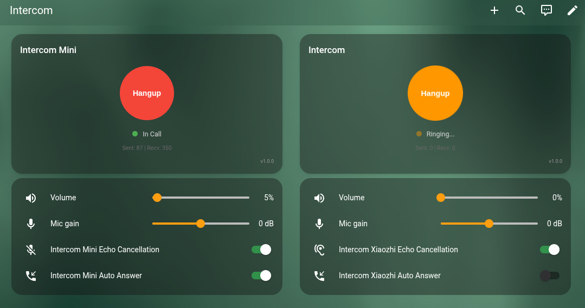
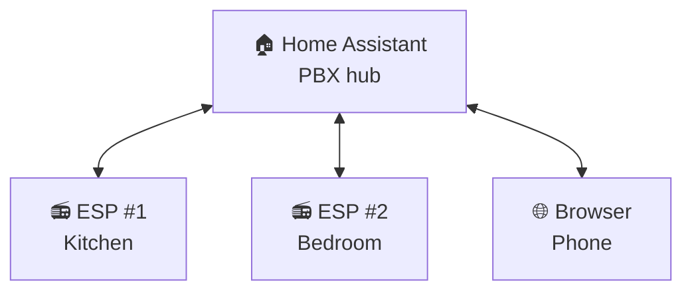
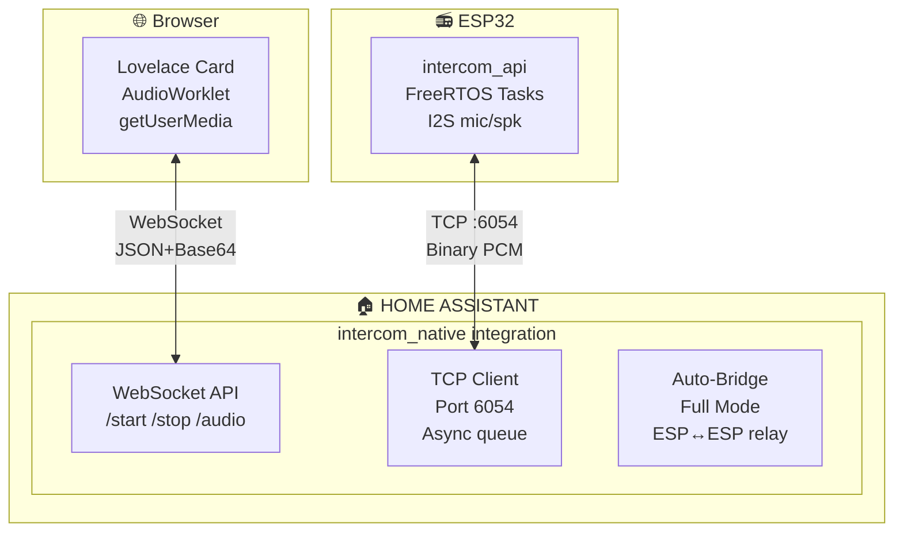
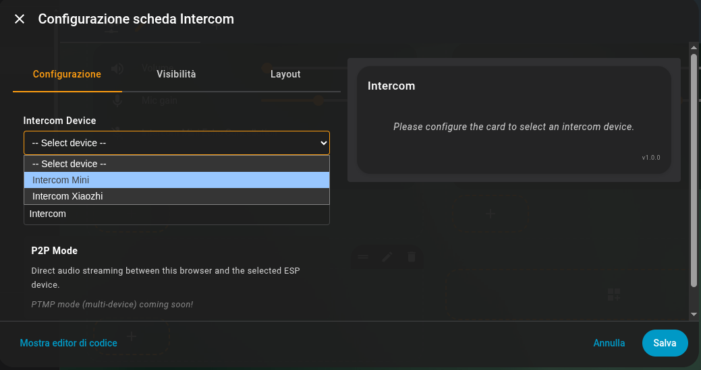
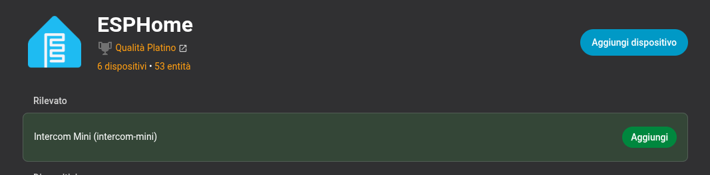
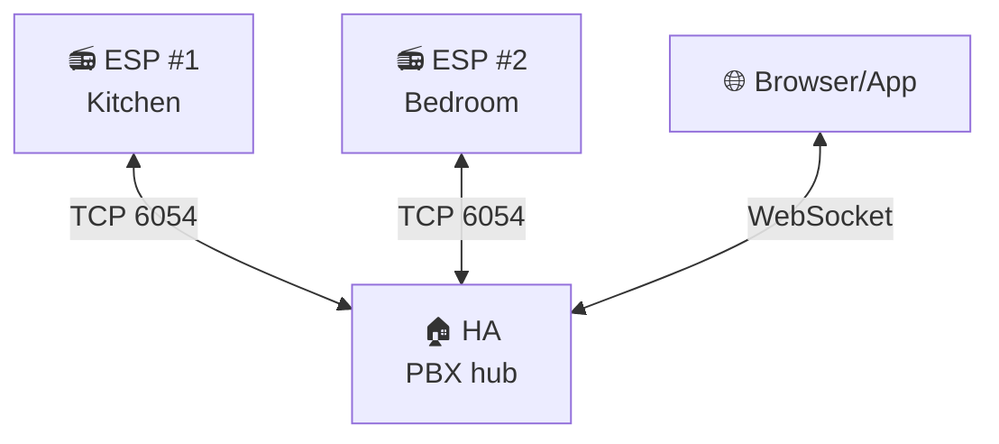
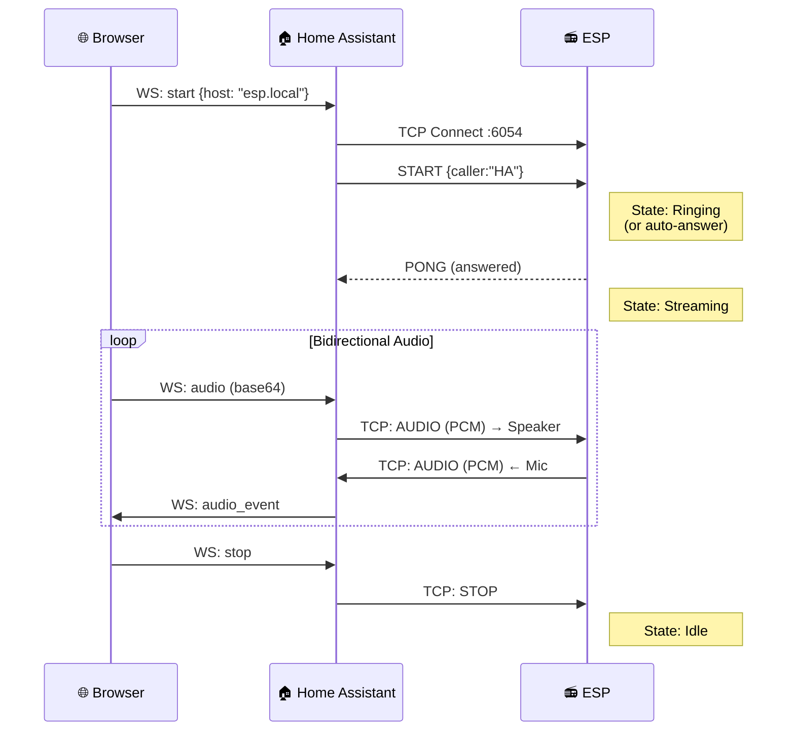
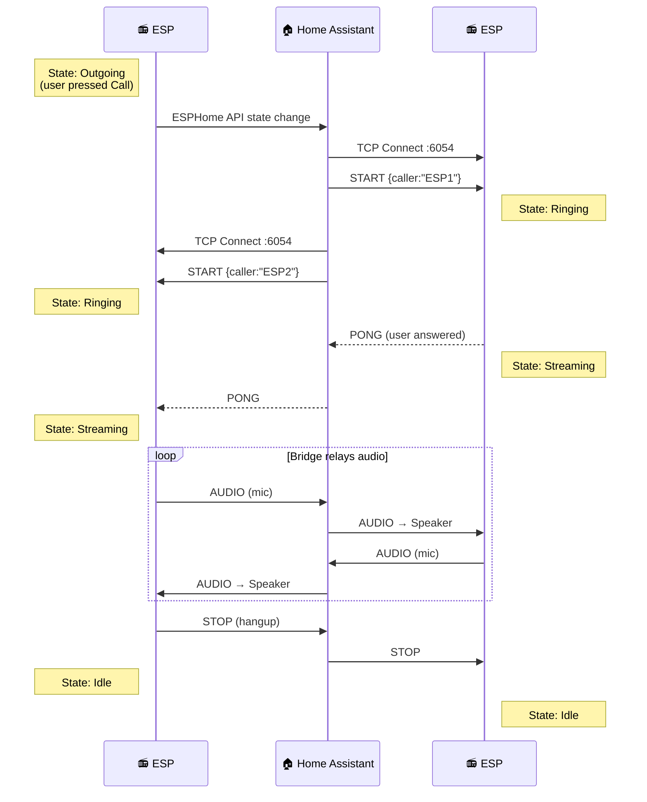
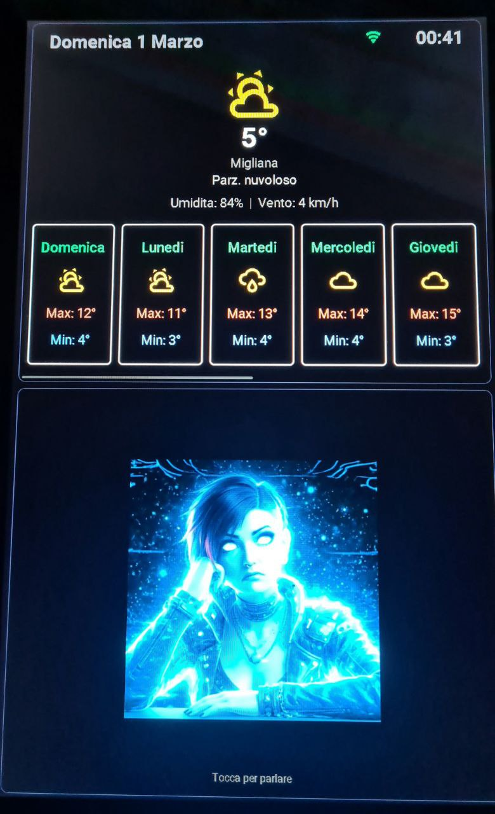
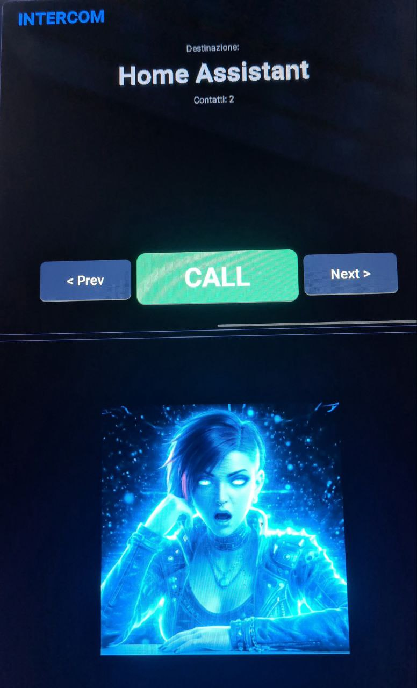

# ESPHome Intercom API

From a simple ESPHome full-duplex doorbell to a PBX-like multi-device intercom, all the way to a complete Voice Assistant experience, with wake word detection, echo cancellation, LVGL touchscreen UI, intercom, and ready-to-flash configs for tested ESP32 hardware.




<table>
  <tr>
    <td align="center"><br/><b>Idle</b></td>
    <td align="center"><br/><b>Calling</b></td>
    <td align="center"><br/><b>Ringing</b></td>
    <td align="center"><br/><b>In Call</b></td>
  </tr>
</table>

## Table of Contents

- [Overview](#overview)
- [Features](#features)
- [Architecture](#architecture)
- [Installation](#installation)
  - [1. Home Assistant Integration](#1-home-assistant-integration)
  - [2. ESPHome Component](#2-esphome-component)
  - [3. Lovelace Card](#3-lovelace-card)
- [Operating Modes](#operating-modes)
  - [Simple Mode](#simple-mode-browser--esp)
  - [Full Mode](#full-mode-esp--esp)
- [Configuration Reference](#configuration-reference)
- [Entities and Controls](#entities-and-controls)
- [Call Flow Diagrams](#call-flow-diagrams)
- [Hardware Support](#hardware-support)
- [i2s_audio_duplex](#i2s_audio_duplex)
- [Voice Assistant + Intercom Experience](#voice-assistant--intercom-experience)
- [Troubleshooting](#troubleshooting)
- [License](#license)

---

## Overview

**Intercom API** is a scalable full-duplex ESPHome intercom framework that grows with your needs:

| Use Case | Configuration | Description |
|----------|---------------|-------------|
| 🔔 **Simple Doorbell** | 1 ESP + Browser | Ring notification, answer from phone/PC |
| 🏠 **Home Intercom** | Multiple ESPs | Call between rooms (Kitchen ↔ Bedroom) |
| 📞 **PBX-like System** | ESPs + Browser + HA | Full intercom network with Home Assistant as a participant |
| 🤖 **Voice Assistant + Intercom** | ESP (display optional) | Wake word, voice commands, weather, intercom, all on one device |

**Home Assistant acts as the central hub** - it can receive calls (doorbell), make calls to ESPs, and relay calls between devices. All audio flows through HA, enabling remote access without complex NAT/firewall configuration.


```mermaid
graph TD
    HA[🏠 Home Assistant<br/>PBX hub]
    ESP1[📻 ESP #1<br/>Kitchen]
    ESP2[📻 ESP #2<br/>Bedroom]
    Browser[🌐 Browser<br/>Phone]

    HA <--> ESP1
    HA <--> ESP2
    HA <--> Browser
```

### Why This Project?

I love Home Assistant and ESPHome. I believed in the project from the early days: well-structured, resilient, stable, and thoughtfully designed from the start. Over the years, for clients, friends, family, and myself, I've managed to automate all kinds of things, but I always struggled with one particular challenge: building a Home Assistant-centric intercom system.

Years ago I had started writing a server that received audio from an ESP microphone, but I abandoned it due to lack of time. Now, with the help of advanced reasoning AI models, the development speed has been incredible. I started in late December 2025 with [esphome-intercom](https://github.com/n-IA-hane/esphome-intercom), which used ESP-to-ESP audio via UDP and go2rtc/WebRTC for the browser side. But several issues quickly emerged with that approach (NAT traversal, STUN/TURN configuration, WebRTC browser quirks), so I set off on a new adventure: creating an intercom standard for ESPHome.

Along the way I discovered that ESPHome couldn't handle a codec and I2S components simultaneously on the same I2S bus, which led to the creation of `i2s_audio_duplex`. I keep having new ideas about use cases, and users have started showing interest in individual components and making feature requests. The situation got out of hand! So here we are:

---

## Features

- **Full-duplex audio** - Talk and listen simultaneously
- **Two operating modes**:
  - **Simple**: Browser ↔ Home Assistant ↔ ESP
  - **Full**: ESP ↔ Home Assistant ↔ ESP (intercom between devices)
- **Echo Cancellation (AEC)** - Built-in acoustic echo cancellation using ESP-SR
  *(ES8311 digital feedback mode provides perfect sample-accurate echo cancellation)*
- **Voice Assistant compatible** - Coexists with ESPHome Voice Assistant and Micro Wake Word
- **Ready-to-flash YAML configs** - Optimized configurations for real, tested hardware that combine Voice Assistant, Micro Wake Word, and Intercom running simultaneously, creating the most complete hub possible for a full Voice Assistant experience
- **Auto Answer** - Configurable automatic call acceptance
- **Ringtone on incoming calls** - Devices play a looping ringtone sound while ringing
- **Volume Control** - Adjustable speaker volume and microphone gain
- **Contact Management** - Select call destination from discovered devices
- **Status LED** - Visual feedback for call states
- **Persistent Settings** - Volume, gain, AEC state saved to flash
- **Remote Access** - Works through any HA remote access method (Nabu Casa, reverse proxy, VPN). No WebRTC, no go2rtc, no port forwarding required

---

## Architecture

### System Overview


```mermaid
graph TB
    subgraph HA[🏠 HOME ASSISTANT]
        subgraph Integration[intercom_native integration]
            WS[WebSocket API<br/>/start /stop /audio]
            TCP[TCP Client<br/>Port 6054<br/>Async queue]
            Bridge[Auto-Bridge<br/>Full Mode<br/>ESP↔ESP relay]
        end
    end

    subgraph Browser[🌐 Browser]
        Card[Lovelace Card<br/>AudioWorklet<br/>getUserMedia]
    end

    subgraph ESP[📻 ESP32]
        API[intercom_api<br/>FreeRTOS Tasks<br/>I2S mic/spk]
    end

    Card <-->|WebSocket<br/>JSON+Base64| WS
    API <-->|TCP :6054<br/>Binary PCM| TCP
```

### Intercom Audio Format (TCP Protocol)

| Parameter | Value |
|-----------|-------|
| Sample Rate | 16000 Hz |
| Bit Depth | 16-bit signed PCM |
| Channels | Mono |
| ESP Chunk Size | 512 bytes (256 samples = 16ms) |
| Browser Chunk Size | 2048 bytes (1024 samples = 64ms) |

### TCP Protocol (Port 6054)

**Header (4 bytes):**

| Byte 0 | Byte 1 | Bytes 2-3 |
|--------|--------|-----------|
| Type | Flags | Length (LE) |

**Message Types:**

| Code | Name | Description |
|------|------|-------------|
| 0x01 | AUDIO | PCM audio data |
| 0x02 | START | Start streaming (includes caller_name, no_ring flag) |
| 0x03 | STOP | Stop streaming |
| 0x04 | PING | Keep-alive |
| 0x05 | PONG | Keep-alive response |
| 0x06 | ERROR | Error notification |

---

## Installation

### 1. Home Assistant Integration

#### Option A: Install via HACS (Recommended)

1. In HACS, go to **⋮ → Custom repositories**
2. Add `https://github.com/n-IA-hane/intercom-api` as **Integration**
3. Find "Intercom Native" and click **Download**
4. Restart Home Assistant
5. Go to **Settings → Integrations → Add Integration** → search "Intercom Native" → click **Submit**

The integration automatically registers the Lovelace card, no manual frontend setup needed.

#### Option B: Manual install

```bash
# From the repository root
cp -r custom_components/intercom_native /config/custom_components/
```

Then either:
- Add via UI: **Settings → Integrations → Add Integration → Intercom Native**
- Or add to `configuration.yaml`: `intercom_native:`

Restart Home Assistant.

The integration will:
- Register WebSocket API commands for the card
- Create `sensor.intercom_active_devices` (lists all intercom ESPs)
- Auto-detect ESP state changes for Full Mode bridging
- Auto-register the Lovelace card as a frontend resource

### 2. ESPHome Component

Add the external component to your ESPHome device configuration:

```yaml
external_components:
  - source: github://n-IA-hane/intercom-api
    components: [intercom_api, esp_aec]
```

#### Minimal Configuration (Simple Mode)

```yaml
esp32:
  board: esp32-s3-devkitc-1
  framework:
    type: esp-idf
    sdkconfig_options:
      # Default is 10, increased for: TCP server + API + OTA
      CONFIG_LWIP_MAX_SOCKETS: "16"

# I2S Audio (example with separate mic/speaker)
i2s_audio:
  - id: i2s_mic_bus
    i2s_lrclk_pin: GPIO3
    i2s_bclk_pin: GPIO2
  - id: i2s_spk_bus
    i2s_lrclk_pin: GPIO6
    i2s_bclk_pin: GPIO7

microphone:
  - platform: i2s_audio
    id: mic_component
    i2s_audio_id: i2s_mic_bus
    i2s_din_pin: GPIO4
    adc_type: external
    pdm: false
    bits_per_sample: 32bit
    sample_rate: 16000

speaker:
  - platform: i2s_audio
    id: spk_component
    i2s_audio_id: i2s_spk_bus
    i2s_dout_pin: GPIO8
    dac_type: external
    sample_rate: 16000
    bits_per_sample: 16bit

# Echo Cancellation (recommended)
esp_aec:
  id: aec_processor
  sample_rate: 16000
  filter_length: 4       # 64ms tail length
  mode: voip_low_cost    # Optimized for real-time

# Intercom API - Simple mode (browser only)
intercom_api:
  id: intercom
  mode: simple
  microphone: mic_component
  speaker: spk_component
  aec_id: aec_processor
```

#### Full Configuration (Full Mode with ESP↔ESP)

```yaml
intercom_api:
  id: intercom
  mode: full                  # Enable ESP↔ESP calls
  microphone: mic_component
  speaker: spk_component
  aec_id: aec_processor
  ringing_timeout: 30s        # Auto-decline unanswered calls

  # FSM event callbacks
  on_ringing:
    - light.turn_on:
        id: status_led
        effect: "Ringing"

  on_outgoing_call:
    - light.turn_on:
        id: status_led
        effect: "Calling"

  on_streaming:
    - light.turn_on:
        id: status_led
        red: 0%
        green: 100%
        blue: 0%

  on_idle:
    - light.turn_off: status_led

# Switches (with restore from flash)
switch:
  - platform: intercom_api
    intercom_api_id: intercom
    auto_answer:
      name: "Auto Answer"
      restore_mode: RESTORE_DEFAULT_OFF
    aec:
      name: "Echo Cancellation"
      restore_mode: RESTORE_DEFAULT_ON

# Volume controls
number:
  - platform: intercom_api
    intercom_api_id: intercom
    speaker_volume:
      name: "Speaker Volume"
    mic_gain:
      name: "Mic Gain"

# Buttons for manual control
button:
  - platform: template
    name: "Call"
    on_press:
      - intercom_api.call_toggle:
          id: intercom

  - platform: template
    name: "Next Contact"
    on_press:
      - intercom_api.next_contact:
          id: intercom

# Subscribe to HA's contact list (Full mode)
text_sensor:
  - platform: homeassistant
    id: ha_active_devices
    entity_id: sensor.intercom_active_devices
    on_value:
      - intercom_api.set_contacts:
          id: intercom
          contacts_csv: !lambda 'return x;'

# Example: call a specific room from HA automation
# or use in YAML lambda with intercom_api.set_contact
button:
  - platform: template
    name: "Call Kitchen"
    on_press:
      - intercom_api.set_contact:
          id: intercom
          contact: "Kitchen Intercom"
      - intercom_api.start:
          id: intercom
```

#### Direct GPIO Calls (Apartment Intercom)

Each GPIO button can call a different room — like a condominium intercom panel:

```yaml
binary_sensor:
  # Button 1: Call Kitchen
  - platform: gpio
    pin:
      number: GPIO4
      mode: INPUT_PULLUP
      inverted: true
    on_press:
      - intercom_api.set_contact:
          id: intercom
          contact: "Kitchen Intercom"
      - intercom_api.start:
          id: intercom

  # Button 2: Call Living Room
  - platform: gpio
    pin:
      number: GPIO5
      mode: INPUT_PULLUP
      inverted: true
    on_press:
      - intercom_api.set_contact:
          id: intercom
          contact: "Living Room Intercom"
      - intercom_api.start:
          id: intercom
```

> ⚠️ **Name matching is exact (case-sensitive).** The `contact` value must match the device name exactly as it appears in the contacts list. There is no fuzzy matching or validation — a typo will silently fail and fire `on_call_failed`.
>
> Contact names come from the `name:` substitution in each device's YAML. Home Assistant converts the ESPHome name to a display name: `name: kitchen-intercom` → HA device name `Kitchen Intercom` (hyphens become spaces, words capitalized).
>
> **How to verify the correct name:** check the `sensor.{name}_destination` entity in HA — cycle through contacts and note the exact string shown for each device.

### 3. Lovelace Card

The Lovelace card is **automatically registered** when the integration loads, no manual file copying or resource registration needed.

#### Add the card to your dashboard

The card is available in the Lovelace card picker - just search for "Intercom":


Then configure it with the visual editor:



Alternatively, you can add it manually via YAML:

```yaml
type: custom:intercom-card
entity_id: <your_esp_device_id>
name: Kitchen Intercom
mode: full  # or 'simple'
```

The card automatically discovers ESPHome devices with the `intercom_api` component.

The Lovelace card provides **full-duplex bidirectional audio** with the ESP device: you can talk and listen simultaneously through your browser or the Home Assistant Companion app. The card captures audio from your microphone via `getUserMedia()` and plays incoming audio from the ESP in real-time.

> **Important: HTTPS required.** Browser microphone access (`getUserMedia`) requires a secure context. You need HTTPS to use the card's audio features. Solutions: [Nabu Casa](https://www.nabucasa.com/), Let's Encrypt, reverse proxy with SSL, or self-signed certificate. Exception: `localhost` works without HTTPS.

> **Note**: Devices must be added to Home Assistant via the ESPHome integration before they appear in the card.



---

## Operating Modes

### Simple Mode (Browser ↔ ESP)

In Simple mode, the browser communicates directly with a single ESP device through Home Assistant. If the ESP has **Auto Answer** enabled, streaming starts automatically when you call.


```mermaid
graph LR
    Browser[🌐 Browser] <-->|WebSocket| HA[🏠 HA]
    HA <-->|TCP 6054| ESP[📻 ESP]
```

**Call Flow (Browser → ESP):**
1. User clicks "Call" in browser
2. Card sends `intercom_native/start` to HA
3. HA opens TCP connection to ESP:6054
4. HA sends START message (caller="Home Assistant")
5. ESP enters Ringing state (or auto-answers)
6. Bidirectional audio streaming begins

**Call Flow (ESP → Browser):**
1. User presses "Call" on ESP (with destination set to "Home Assistant")
2. ESP sends RING message to HA
3. HA notifies all connected browser cards
4. Card shows incoming call with Answer/Decline buttons
5. User clicks "Answer" in browser
6. Bidirectional audio streaming begins

**Use Simple mode when:**
- You want a simple doorbell with full-duplex audio
- You need browser-to-ESP **and** ESP-to-browser communication
- You want minimal configuration

### Full Mode (PBX-like)

Full mode includes everything from Simple mode (Browser ↔ ESP calls) **plus** enables a PBX-like system where ESP devices can also call each other through Home Assistant, which acts as an audio relay.



```mermaid
graph TB
    ESP1[📻 ESP #1<br/>Kitchen] <-->|TCP 6054| HA[🏠 HA<br/>PBX hub]
    ESP2[📻 ESP #2<br/>Bedroom] <-->|TCP 6054| HA
    Browser[🌐 Browser/App] <-->|WebSocket| HA
```

**Call Flow (ESP #1 calls ESP #2):**
1. User selects "Bedroom" on ESP #1 display/button
2. User presses Call button → ESP #1 enters "Outgoing" state
3. HA detects state change via ESPHome API
4. HA sends START to ESP #2 (caller="Kitchen")
5. ESP #2 enters "Ringing" state
6. User answers on ESP #2 (or auto-answer)
7. HA bridges audio: ESP #1 ↔ HA ↔ ESP #2
8. Either device can hangup → STOP propagates to both

**Full mode features:**
- Contact list auto-discovery from HA
- Next/Previous contact navigation
- Caller ID display
- Ringing timeout with auto-decline
- Bidirectional hangup propagation

### ESP calling Home Assistant (Doorbell)

When an ESP device has "Home Assistant" selected as destination and initiates a call (via GPIO button press or template button), it fires an `esphome.intercom_call` event for notifications and the Lovelace card goes into ringing state with Answer/Decline buttons:


---

## Configuration Reference

### intercom_api Component

| Option | Type | Default | Description |
|--------|------|---------|-------------|
| `id` | ID | Required | Component ID |
| `mode` | string | `simple` | `simple` (browser only) or `full` (ESP↔ESP) |
| `microphone` | ID | Required | Reference to microphone component |
| `speaker` | ID | Required | Reference to speaker component |
| `aec_id` | ID | - | Reference to esp_aec component |
| `dc_offset_removal` | bool | false | Remove DC offset (for mics like SPH0645) |
| `ringing_timeout` | time | 0s | Auto-decline after timeout (0 = disabled) |

### Event Callbacks

| Callback | Trigger | Use Case |
|----------|---------|----------|
| `on_ringing` | Incoming call (auto_answer OFF) | Turn on ringing LED/sound, show display page |
| `on_outgoing_call` | User initiated call | Show "Calling..." status |
| `on_answered` | Call was answered (local or remote) | Log event |
| `on_streaming` | Audio streaming active | Solid LED, enable amp |
| `on_idle` | State returns to idle | Turn off LED, disable amp |
| `on_hangup` | Call ended normally | Log with reason string |
| `on_call_failed` | Call failed (unreachable, busy, etc.) | Show error with reason string |

### Actions

| Action | Description |
|--------|-------------|
| `intercom_api.start` | Start outgoing call |
| `intercom_api.stop` | Hangup current call |
| `intercom_api.answer_call` | Answer incoming call |
| `intercom_api.decline_call` | Decline incoming call |
| `intercom_api.call_toggle` | Smart: idle→call, ringing→answer, streaming→hangup |
| `intercom_api.next_contact` | Select next contact (Full mode) |
| `intercom_api.prev_contact` | Select previous contact (Full mode) |
| `intercom_api.set_contacts` | Update contact list from CSV |
| `intercom_api.set_contact` | Select a specific contact by name |
| `intercom_api.set_volume` | Set speaker volume (float, 0.0–1.0) |
| `intercom_api.set_mic_gain_db` | Set microphone gain (float, -20.0 to +20.0 dB) |

### Conditions

| Condition | Returns true when |
|-----------|-------------------|
| `intercom_api.is_idle` | State is Idle |
| `intercom_api.is_ringing` | State is Ringing (incoming) |
| `intercom_api.is_calling` | State is Outgoing (waiting answer) |
| `intercom_api.is_in_call` | State is Streaming (active call) |
| `intercom_api.is_streaming` | Audio is actively streaming |
| `intercom_api.is_answering` | Call is being answered |
| `intercom_api.is_incoming` | Has incoming call |

### esp_aec Component

| Option | Type | Default | Description |
|--------|------|---------|-------------|
| `id` | ID | Required | Component ID |
| `sample_rate` | int | 16000 | Must match audio sample rate |
| `filter_length` | int | 4 | Echo tail in frames (4 = 64ms) |
| `mode` | string | `voip_low_cost` | AEC algorithm mode |

**AEC modes** (ESP-SR library - two completely different engines):

| Mode | Engine | CPU (Core 0) | RES | MWW on post-AEC | Recommended |
|------|--------|-------------|-----|-----------------|-------------|
| `sr_low_cost` | `esp_aec3` (linear) | **~22%** | No | **10/10** | **Yes - for VA + MWW** |
| `sr_high_perf` | `esp_aec3` (FFT) | ~25% | No | 10/10 | No (DMA memory issues on S3) |
| `voip_low_cost` | `dios_ssp_aec` (Speex) | ~58% | Yes | 2/10 | Only if MWW not needed |
| `voip_high_perf` | `dios_ssp_aec` | ~64% | Yes | 2/10 | No |

> **Important**: SR modes use a **linear-only** adaptive filter that preserves spectral features for neural wake word detection. VOIP modes add a **residual echo suppressor** (RES) that distorts features, reducing MWW detection from 10/10 to 2/10. Use `sr_low_cost` for VA + MWW setups. SR mode requires `buffers_in_psram: true` on ESP32-S3 (512-sample frames need more memory). See [i2s_audio_duplex README](esphome/components/i2s_audio_duplex/README.md#aec-cpu-impact) for details.

---

## Entities and Controls

### Auto-created Entities (always)

| Entity | Type | Description |
|--------|------|-------------|
| `sensor.{name}_intercom_state` | Text Sensor | Current state: Idle, Ringing, Streaming, etc. |

### Auto-created Entities (Full mode only)

| Entity | Type | Description |
|--------|------|-------------|
| `sensor.{name}_destination` | Text Sensor | Currently selected contact |
| `sensor.{name}_caller` | Text Sensor | Who is calling (during incoming call) |
| `sensor.{name}_contacts` | Text Sensor | Contact count |

### Platform Entities (declared in YAML)

| Platform | Entities |
|----------|----------|
| `switch` | `auto_answer`, `aec` |
| `number` | `speaker_volume` (0-100%), `mic_gain` (-20 to +20 dB) |
| `button` | Call, Next Contact, Prev Contact, Decline (template) |

---

## Call Flow Diagrams

### Simple Mode: Browser calls ESP


```mermaid
sequenceDiagram
    participant B as 🌐 Browser
    participant HA as 🏠 Home Assistant
    participant E as 📻 ESP

    B->>HA: WS: start {host: "esp.local"}
    HA->>E: TCP Connect :6054
    HA->>E: START {caller:"HA"}
    Note right of E: State: Ringing<br/>(or auto-answer)
    E-->>HA: PONG (answered)
    Note right of E: State: Streaming

    loop Bidirectional Audio
        B->>HA: WS: audio (base64)
        HA->>E: TCP: AUDIO (PCM) → Speaker
        E->>HA: TCP: AUDIO (PCM) ← Mic
        HA->>B: WS: audio_event
    end

    B->>HA: WS: stop
    HA->>E: TCP: STOP
    Note right of E: State: Idle
```

### Full Mode: ESP calls ESP


```mermaid
sequenceDiagram
    participant E1 as 📻 ESP #1 (Caller)
    participant HA as 🏠 Home Assistant
    participant E2 as 📻 ESP #2 (Callee)

    Note left of E1: State: Outgoing<br/>(user pressed Call)
    E1->>HA: ESPHome API state change
    HA->>E2: TCP Connect :6054
    HA->>E2: START {caller:"ESP1"}
    Note right of E2: State: Ringing
    HA->>E1: TCP Connect :6054
    HA->>E1: START {caller:"ESP2"}
    Note left of E1: State: Ringing

    E2-->>HA: PONG (user answered)
    Note right of E2: State: Streaming
    HA-->>E1: PONG
    Note left of E1: State: Streaming

    loop Bridge relays audio
        E1->>HA: AUDIO (mic)
        HA->>E2: AUDIO → Speaker
        E2->>HA: AUDIO (mic)
        HA->>E1: AUDIO → Speaker
    end

    E1->>HA: STOP (hangup)
    HA->>E2: STOP
    Note left of E1: State: Idle
    Note right of E2: State: Idle
```

---

## Hardware Support

### Tested Configurations

| Device | Microphone | Speaker | I2S Mode | Component | AEC Reference | VA/MWW | Tested by |
|--------|------------|---------|----------|-----------|---------------|--------|-----------|
| ESP32-S3 Mini | SPH0645 | MAX98357A | Dual bus | `i2s_audio` | Ring buffer | Yes (mixer speaker) | [@n-IA-hane](https://github.com/n-IA-hane) |
| Xiaozhi Ball V3 | ES8311 | ES8311 | Single bus | `i2s_audio_duplex` | ES8311 digital feedback (stereo) | Yes (SR AEC) | [@n-IA-hane](https://github.com/n-IA-hane) |
| Waveshare ESP32-S3-AUDIO | ES7210 (4-ch) | ES8311 | Single bus TDM | `i2s_audio_duplex` | ES7210 TDM analog (MIC3, 30dB) | Yes (SR AEC) | [@n-IA-hane](https://github.com/n-IA-hane) |
| Waveshare ESP32-P4-WiFi6-Touch-LCD-10.1 | ES7210 (4-ch) | ES8311 | Single bus TDM | `i2s_audio_duplex` | ES7210 TDM analog (MIC3, 30dB) | Yes (SR AEC, LVGL touch display) | [@n-IA-hane](https://github.com/n-IA-hane) |
| [Onju Voice](https://github.com/justLV/onju-voice) | MEMS (dual) | DAC + mute GPIO | Single bus | `i2s_audio_duplex` | Ring buffer | Yes (SR AEC) | [@rmeissn](https://github.com/rmeissn) |

> **Want to help expand this list?** Send me a device to test or consider a [donation](https://github.com/sponsors/n-IA-hane), every bit helps!

### Requirements

- **ESP32-S3** or **ESP32-P4** with PSRAM (required for AEC)
- I2S microphone (INMP441, SPH0645, ES8311, etc.)
- I2S speaker amplifier (MAX98357A, ES8311, etc.)
- ESP-IDF framework (not Arduino)
- **sdkconfig tuning** for PSRAM devices: `DATA_CACHE_64KB` + `DATA_CACHE_LINE_64B` (S3) or `CACHE_L2_CACHE_256KB` (P4), plus `SPIRAM_FETCH_INSTRUCTIONS` + `SPIRAM_RODATA`. See [i2s_audio_duplex README](esphome/components/i2s_audio_duplex/README.md#psram-and-sdkconfig-requirements) for details.

---

## i2s_audio_duplex

This repo also provides **[i2s_audio_duplex](esphome/components/i2s_audio_duplex/)**, a full-duplex I2S component for single-bus audio codecs (ES8311, ES8388, WM8960) and multi-codec TDM setups (ES8311 + ES7210). Standard ESPHome `i2s_audio` cannot drive mic and speaker on the same I2S bus simultaneously; `i2s_audio_duplex` solves this with:

- **True full-duplex** on a single I2S bus
- **Built-in AEC integration**: stereo digital feedback, TDM hardware reference, or ring buffer
- **Single mic path for all**: with `sr_low_cost` AEC, MWW + VA + intercom all use the same post-AEC mic (linear AEC preserves spectral features)
- **PSRAM buffer support**: `buffers_in_psram` option frees ~28KB internal heap (required for SR AEC mode)
- **FIR decimation**: the bus runs at 48kHz (codec native) for full-quality speaker output; microphone audio is decimated to 16kHz only for components that require it (AEC, Voice Assistant STT, Intercom)
- **Reference counting**: multiple consumers share the same mic safely

### Audio Pipeline

The I2S bus runs at 48kHz for full-quality audio playback (TTS, media, intercom). Microphone output is decimated to 16kHz via FIR filter only because AEC, Voice Assistant STT, and Intercom are hardcoded to 16kHz:

| Parameter | Value |
|-----------|-------|
| I2S Bus Rate | Configurable (`sample_rate`, e.g. 48000 Hz) |
| Output Rate | Configurable (`output_sample_rate`, e.g. 16000 Hz) |
| Decimation | FIR filter, ratio = bus/output (e.g. ×3 for 48→16kHz) |
| FIR Filter | 31-tap, Kaiser beta=8.0, ~60dB stopband, linear phase |
| Speaker Input | Bus rate (48kHz), ESPHome resampler upsamples before play |
| Mic Output | Output rate (16kHz), for MWW, Voice Assistant, Intercom |

MWW, Voice Assistant STT, and Intercom operate at 16kHz internally. The I2S bus runs at 48kHz (the codec's native rate), so:
- **TTS** via `announcement_pipeline` with `sample_rate: 48000` arrives at 48kHz from HA. Full 48kHz quality to the DAC.
- **Streaming radio / Music Assistant** audio arrives at the sample rate declared by the media player -48kHz when configured as such.
- **Media files** (timer sounds, notifications) at native 48kHz are played directly without resampling.
- **Intercom audio** is sent/received at 16kHz over TCP and upsampled to 48kHz for local playback via the resampler speaker.

### Single-Bus Codecs (ES8311, ES8388, WM8960)

Many integrated codecs use a single I2S bus for both mic and speaker. Standard ESPHome `i2s_audio` **cannot handle this** simultaneously. Use `i2s_audio_duplex`:

```yaml
external_components:
  - source: github://n-IA-hane/intercom-api
    components: [intercom_api, i2s_audio_duplex, esp_aec]

i2s_audio_duplex:
  id: i2s_duplex
  i2s_lrclk_pin: GPIO45
  i2s_bclk_pin: GPIO9
  i2s_mclk_pin: GPIO16
  i2s_din_pin: GPIO10
  i2s_dout_pin: GPIO8
  sample_rate: 48000           # I2S bus rate (codec native)
  output_sample_rate: 16000    # Mic output rate for AEC/VA/Intercom (FIR decimation x3)

microphone:
  - platform: i2s_audio_duplex
    id: mic_component
    i2s_audio_duplex_id: i2s_duplex

speaker:
  - platform: i2s_audio_duplex
    id: spk_component
    i2s_audio_duplex_id: i2s_duplex
```

### ES8311 Stereo L/R Reference

If your codec supports it (ES8311, and potentially others with DAC loopback), **stereo digital feedback is the optimal AEC reference method**. This is the single most impactful configuration choice.

**How it works:**
- ES8311 outputs a stereo I2S frame: **L channel = DAC loopback** (what the speaker is playing), **R channel = ADC** (microphone)
- The reference signal is **sample-accurate**: same I2S frame as the mic capture, no timing estimation needed
- `aec_reference_delay_ms: 10` (just a few ms for internal codec latency, vs ~80ms for ring buffer mode)

```yaml
i2s_audio_duplex:
  aec_id: aec_component
  use_stereo_aec_reference: true   # Enable DAC feedback
  aec_reference_delay_ms: 10       # Sample-aligned, minimal delay

esphome:
  on_boot:
    - lambda: |-
        // Configure ES8311 register 0x44: output DAC+ADC on stereo ASDOUT
        uint8_t data[2] = {0x44, 0x48};
        id(i2c_bus).write(0x18, data, 2);
```

Without stereo feedback, the component falls back to a **ring buffer reference**: it copies speaker audio to a delay buffer and reads it back ~80ms later to match the acoustic path. This works with any codec but requires careful delay tuning and is never perfectly aligned.

### TDM Hardware Reference (ES7210 + ES8311)

For boards with a multi-channel ADC (ES7210), the AEC reference can be captured as a hardware analog signal: the ES8311 DAC output is wired to an ES7210 input (MIC3), providing a sample-aligned reference from the same TDM I2S frame:

```yaml
i2s_audio_duplex:
  id: i2s_duplex
  i2s_lrclk_pin: GPIO14
  i2s_bclk_pin: GPIO13
  i2s_mclk_pin: GPIO12
  i2s_din_pin: GPIO15
  i2s_dout_pin: GPIO16
  sample_rate: 48000
  output_sample_rate: 16000
  aec_id: aec_processor
  use_tdm_reference: true
  tdm_total_slots: 4
  tdm_mic_slots: [0, 2]       # ADC1(MIC1), ADC2(MIC2)
  tdm_ref_slot: 1             # ADC3(MIC3) = ES8311 DAC feedback
```

> **Note**: ES7210 requires an `on_boot` lambda (priority 200) to enable TDM mode and set MIC3 gain to 0dB. See `waveshare-s3-audio-va-intercom.yaml` for the complete working config.

### Dual Mic Paths

`i2s_audio_duplex` provides two microphone outputs, raw (pre-AEC) and AEC-processed, enabling wake word detection during TTS playback:

```yaml
microphone:
  - platform: i2s_audio_duplex
    id: mic_aec                    # AEC-processed: for VA STT + intercom TX
    i2s_audio_duplex_id: i2s_duplex

  - platform: i2s_audio_duplex
    id: mic_raw                    # Raw: for MWW (pre-AEC, hears through TTS)
    i2s_audio_duplex_id: i2s_duplex
    pre_aec: true

micro_wake_word:
  microphone: mic_raw              # Raw mic for best wake word detection

voice_assistant:
  microphone: mic_aec              # AEC mic for clean STT
```

See the [i2s_audio_duplex README](esphome/components/i2s_audio_duplex/README.md) for full details.

---

## Voice Assistant + Intercom Experience

<table>
  <tr>
    <td align="center"><br/><b>ESP32-P4: Weather + Voice Assistant</b></td>
    <td align="center"><br/><b>ESP32-P4: Intercom + Voice Assistant</b></td>
    <td align="center"><br/><b>Xiaozhi Ball: VA + Intercom</b></td>
  </tr>
</table>

The Voice Assistant and Intercom coexist seamlessly on the same hardware: shared microphone, shared speaker (via audio mixer), shared wake word detection. No display required (works on headless devices like the Waveshare S3 Audio); on devices with a screen, you also get a full touch UI:

- **Always listening**: Micro Wake Word runs continuously on raw (pre-AEC) audio, detecting the wake word even while TTS is playing or during an intercom call
- **Touch or voice**: Start the assistant by saying the wake word or tapping the screen (on touch displays)
- **Barge-in**: Say the wake word during a TTS response to interrupt and ask a new question
- **Intercom calls**: Call other devices or Home Assistant with one tap; incoming calls ring with audio + visual feedback
- **Weather at a glance**: Current conditions, temperature, and 5-day forecast updated automatically (touch displays)
- **Mood-aware responses**: The assistant shows different expressions (happy, neutral, angry) based on the tone of its reply. Requires instructing your LLM to prepend an ASCII emoticon (`:-)` `:-(` `:-|`) to each response based on its tone
- **Custom AI avatars**: On devices with a display, you can create your own assistant avatar by providing a set of PNG images in a standard folder structure. Set the `ai_avatar` substitution in your YAML to pick which avatar to use:

  ```yaml
  substitutions:
    ai_avatar: my_assistant    # uses images/assistant/my_assistant/
  ```

  Each avatar folder must contain the following files:

  | File | Purpose |
  |------|---------|
  | `idle_00.png` ... `idle_19.png` | Idle animation frames (20 frames, looped) |
  | `listening.png` | Displayed while the assistant is listening |
  | `thinking.png` | Displayed while the assistant is processing |
  | `loading.png` | Displayed during initialization |
  | `error.png` | Displayed on assistant error |
  | `timer_finished.png` | Displayed when a timer completes |
  | `happy.png` | Mood background for positive responses |
  | `neutral.png` | Mood background for neutral responses |
  | `angry.png` | Mood background for negative responses |
  | `error_no_wifi.png` | WiFi disconnected overlay |
  | `error_no_ha.png` | Home Assistant disconnected overlay |

  The folder name matches the avatar identity (e.g. `images/assistant/troiaio/`). To switch avatar, just change the substitution. Images are resized automatically at compile time (240x240 for Xiaozhi Ball, 400x400 for P4 Touch LCD).

### AEC Best Practices

AEC uses Espressif's closed-source ESP-SR library. All modes have similar CPU cost per frame (~7ms out of 16ms budget). The difference is primarily in memory allocation and adaptive filter quality.

**Recommended: `voip_low_cost`** for devices with integrated codecs (ES8311, ES8388). This is more than sufficient for echo cancellation in voice calls and intercom, while keeping CPU free for Voice Assistant, MWW, and display rendering.

```yaml
esp_aec:
  sample_rate: 16000
  filter_length: 4       # 64ms tail, sufficient for integrated codecs
  mode: voip_low_cost    # Light on resources, good echo cancellation
```

If you are **not** using a display or AEC-heavy workloads, and want to experiment with better cancellation quality, you can try `voip_high_perf` with `filter_length: 8`. But `voip_low_cost` is the safe default.

**Avoid `sr_high_perf`**: It allocates very large DMA buffers that can exhaust memory on ESP32-S3, causing SPI errors and instability.

### AEC Timeout Gating

AEC processing is automatically gated: it only runs when the speaker had real audio within the last 250ms. When the speaker is silent (idle, no TTS, no intercom audio), AEC is bypassed and mic audio passes through unchanged.

This prevents the adaptive filter from drifting during silence, which would otherwise suppress the mic signal and kill wake word detection. The gating is transparent, no configuration needed.

### Custom Wake Words

Two custom Micro Wake Word models trained by the author are included in the `wakewords/` directory:

- **Hey Bender** (`hey_bender.json`): inspired by the Futurama character
- **Hey Trowyayoh** (`hey_trowyayoh.json`): phonetic spelling of the Italian word *"troiaio"* (roughly: "what a mess", or more colorfully, "bullshit")

These are standard `.json` + `.tflite` files compatible with ESPHome's `micro_wake_word`. To use them:

```yaml
micro_wake_word:
  models:
    - model: "wakewords/hey_trowyayoh.json"
```

### LVGL Display

Running a display alongside Voice Assistant, Micro Wake Word, AEC, and intercom on a single ESP32-S3 is challenging due to RAM and CPU constraints. The `xiaozhi-ball-v3.yaml` and `waveshare-p4-touch-lcd-va-intercom.yaml` configs demonstrate proven approaches using **LVGL** (Light and Versatile Graphics Library):

| Before (ili9xxx manual) | After (LVGL) |
|---|---|
| 14 C++ page lambdas | Declarative YAML widgets |
| 26 `component.update` calls | Automatic dirty-region refresh |
| `animate_display` script (40 lines) | `animimg` widget (built-in) |
| `text_pagination_timer` script | `long_mode: SCROLL_CIRCULAR` |
| Precomputed geometry (chord widths, x/y metrics) | LVGL layout engine |
| Manual ping-pong frame logic | Duplicated frame list in `animimg src:` |

Key benefits: lower CPU (dirty-region only), no `component.update` contention, native animation (`animimg`), mood-based backgrounds via `lv_img_set_src()`, and automatic text scrolling (`SCROLL_CIRCULAR`).

Timer overlays use `top_layer` with `LV_OBJ_FLAG_HIDDEN`, visible on any page. Media files are auto-resampled by the `platform: resampler` speaker in the mixer pipeline.

### Experiment and Tune

Every setup is different: room acoustics, mic sensitivity, speaker placement, codec characteristics. We encourage you to:

- **Try different `filter_length` values** (4 vs 8), longer isn't always better if your acoustic path is short
- **Toggle AEC on/off during calls** to hear the difference; the `aec` switch is available in HA
- **Adjust `mic_gain`** (-20 to +30 dB): higher gain helps voice detection but can introduce noise
- **Test MWW during TTS** with your specific wake word, some words are more robust than others
- **Compare `voip_low_cost` vs `voip_high_perf`**: the difference may be subtle in your environment
- **Monitor ESP logs**: AEC diagnostics, task timing, and heap usage are all logged at DEBUG level

---

## Troubleshooting

### Card shows "No devices found"

1. Verify `intercom_native:` is in `configuration.yaml`
2. Restart Home Assistant after adding the integration
3. Ensure ESP device is connected via ESPHome integration
4. Check ESP has `intercom_api` component configured
5. Clear browser cache and reload

### No audio from ESP speaker

1. Check speaker wiring and I2S pin configuration
2. Verify `speaker_enable` GPIO if your amp has an enable pin
3. Check volume level (default 80%)
4. Look for I2S errors in ESP logs

### No audio from browser

1. Check browser microphone permissions
2. Verify HTTPS (required for getUserMedia)
3. Check browser console for AudioContext errors
4. Try a different browser (Chrome recommended)

### Echo or feedback

1. Enable AEC: create `esp_aec` component and link with `aec_id`
2. Ensure AEC switch is ON in Home Assistant
3. Reduce speaker volume
4. Increase physical distance between mic and speaker

### High latency

1. Check WiFi signal strength (should be > -70 dBm)
2. Verify Home Assistant is not overloaded
3. Check for network congestion
4. Reduce ESP log level to `WARN`

### ESP shows "Ringing" but browser doesn't connect

1. Check TCP port 6054 is accessible
2. Verify no firewall blocking HA→ESP connection
3. Check Home Assistant logs for connection errors
4. Try restarting the ESP device

### Full mode: ESP doesn't see other devices

1. Ensure all ESPs use `mode: full`
2. Verify `sensor.intercom_active_devices` exists in HA
3. Check ESP subscribes to this sensor via `text_sensor: platform: homeassistant`
4. Devices must be online and connected to HA

---

## Home Assistant Automation

When an ESP device calls "Home Assistant", it fires an `esphome.intercom_call` event. Use this automation to receive push notifications:

```yaml
alias: Doorbell Notification
description: Send push notification when doorbell rings - tap to open intercom
triggers:
  - trigger: event
    event_type: esphome.intercom_call
conditions: []
actions:
  - action: notify.mobile_app_your_phone
    data:
      title: "🔔 Incoming Call"
      message: "📞 {{ trigger.event.data.caller }} is calling..."
      data:
        clickAction: /lovelace/intercom
        channel: doorbell
        importance: high
        ttl: 0
        priority: high
        actions:
          - action: URI
            title: "📱 Open"
            uri: /lovelace/intercom
          - action: ANSWER
            title: "✅ Answer"
  - action: persistent_notification.create
    data:
      title: "🔔 Incoming Call"
      message: "📞 {{ trigger.event.data.caller }} is calling..."
      notification_id: intercom_call
mode: single
```

**Event data available:**
- `trigger.event.data.caller` - Device name (e.g., "Intercom Xiaozhi")
- `trigger.event.data.destination` - Always "Home Assistant"
- `trigger.event.data.type` - "doorbell"

> **Note**: Replace `notify.mobile_app_your_phone` with your mobile app service and `/lovelace/intercom` with your dashboard URL.

> **💡 The possibilities are endless!** This event can trigger any Home Assistant automation. Some ideas: flash smart lights to get attention, play a chime on media players, announce "Someone is at the door" via TTS on your smart speakers, auto-unlock for trusted callers, trigger a camera snapshot, or notify all family members simultaneously.

---

## Example Dashboard

```yaml
title: Intercom
views:
  - title: Intercom
    icon: mdi:phone-voip
    cards: []
    type: sections
    max_columns: 2
    sections:
      - type: grid
        cards:
          - type: custom:intercom-card
            entity_id: <your_device_id>
            name: Waveshare S3 Audio
            mode: full
          - type: entities
            entities:
              - entity: number.<your_device>_speaker_volume
                name: Volume
              - entity: number.<your_device>_mic_gain
                name: Mic gain
              - entity: switch.<your_device>_echo_cancellation
              - entity: switch.<your_device>_auto_answer
              - entity: button.<your_device>_restart
              - entity: sensor.<your_device>_contacts
              - entity: select.<your_device>_wake_word
              - entity: switch.<your_device>_wake_word
              - entity: switch.<your_device>_mic_mute
              - entity: switch.<your_device>_speaker_mute
      - type: grid
        cards:
          - type: custom:intercom-card
            entity_id: <your_device_id>
            name: Xiaozhi Ball V3
            mode: full
          - type: entities
            entities:
              - entity: number.<your_device>_speaker_volume
                name: Volume
              - entity: number.<your_device>_mic_gain
                name: Mic gain
              - entity: switch.<your_device>_echo_cancellation
              - entity: switch.<your_device>_auto_answer
              - entity: button.<your_device>_restart
              - entity: sensor.<your_device>_contacts
              - entity: select.<your_device>_wake_word
              - entity: switch.<your_device>_wake_word
              - entity: switch.<your_device>_mic_mute
              - entity: switch.<your_device>_speaker_mute
      - type: grid
        cards:
          - type: custom:intercom-card
            entity_id: <your_device_id>
            name: Waveshare P4 Touch
            mode: full
          - type: entities
            entities:
              - entity: number.<your_device>_speaker_volume
                name: Volume
              - entity: number.<your_device>_mic_gain
                name: Mic gain
              - entity: switch.<your_device>_echo_cancellation
              - entity: switch.<your_device>_auto_answer
              - entity: button.<your_device>_restart
              - entity: sensor.<your_device>_contacts
              - entity: select.<your_device>_wake_word
              - entity: switch.<your_device>_wake_word
              - entity: switch.<your_device>_mic_mute
              - entity: switch.<your_device>_speaker_mute
```

---

## Example YAML Files

Working configs tested on real hardware are included in the repository:

| File | Device | Features |
|------|--------|----------|
| [`xiaozhi-ball-v3.yaml`](xiaozhi-ball-v3.yaml) | Xiaozhi Ball V3 (ES8311) | VA + MWW + Intercom + LVGL display + 48kHz audio |
| [`xiaozhi-ball-v3-intercom.yaml`](xiaozhi-ball-v3-intercom.yaml) | Xiaozhi Ball V3 (ES8311) | Intercom only, C++ display |
| [`waveshare-s3-audio-va-intercom.yaml`](waveshare-s3-audio-va-intercom.yaml) | Waveshare ESP32-S3-AUDIO (ES8311 + ES7210) | VA + MWW + Intercom + TDM AEC + LED feedback |
| [`waveshare-p4-touch-lcd-va-intercom.yaml`](waveshare-p4-touch-lcd-va-intercom.yaml) | Waveshare ESP32-P4-WiFi6-Touch-LCD-10.1 (ES8311 + ES7210) | VA + MWW + Intercom + LVGL 10.1" touch split-screen (weather + intercom tileview, touch-to-talk VA with mood images, 5-day forecast) + ringtone |
| [`esp32-s3-mini-va-intercom.yaml`](esp32-s3-mini-va-intercom.yaml) | ESP32-S3 Mini (SPH0645 + MAX98357A) | VA + MWW + Intercom, LED feedback |
| [`esp32-s3-mini-intercom.yaml`](esp32-s3-mini-intercom.yaml) | ESP32-S3 Mini (SPH0645 + MAX98357A) | Intercom only, LED feedback |

---

## Support the Project

If this project was helpful and you'd like to see more useful ESPHome/Home Assistant integrations, please consider supporting my work:

[](https://github.com/sponsors/n-IA-hane)

Your support helps me dedicate more time to open source development. Thank you! 🙏

---

## License

MIT License - See [LICENSE](LICENSE) for details.

---

## Contributing

Contributions are welcome! Please open an issue or pull request on GitHub.

## Credits

Developed with the help of the ESPHome and Home Assistant communities, and [Claude Code](https://claude.ai/code) as AI pair programming assistant.
