# ESPHome Intercom API

A flexible intercom framework for ESP32 devices - from simple full-duplex doorbell to PBX-like multi-device system.


<table>
  <tr>
    <td align="center"><br/><b>Idle</b></td>
    <td align="center"><br/><b>Calling</b></td>
    <td align="center"><br/><b>Ringing</b></td>
    <td align="center"><br/><b>In Call</b></td>
  </tr>
</table>

## Table of Contents

- [Overview](#overview)
- [Features](#features)
- [Architecture](#architecture)
- [Installation](#installation)
  - [1. Home Assistant Integration](#1-home-assistant-integration)
  - [2. ESPHome Component](#2-esphome-component)
  - [3. Lovelace Card](#3-lovelace-card)
- [Operating Modes](#operating-modes)
  - [Simple Mode](#simple-mode-browser--esp)
  - [Full Mode](#full-mode-esp--esp)
- [Configuration Reference](#configuration-reference)
- [Entities and Controls](#entities-and-controls)
- [Call Flow Diagrams](#call-flow-diagrams)
- [Hardware Support](#hardware-support)
- [Voice Assistant Coexistence & AEC Best Practices](#voice-assistant-coexistence--aec-best-practices)
- [LVGL Display Coexistence](#lvgl-display-coexistence)
- [Troubleshooting](#troubleshooting)
- [License](#license)

---

## Overview

**Intercom API** is a scalable full-duplex ESPHome intercom framework that grows with your needs:

| Use Case | Configuration | Description |
|----------|---------------|-------------|
| 🔔 **Simple Doorbell** | 1 ESP + Browser | Ring notification, answer from phone/PC |
| 🏠 **Home Intercom** | Multiple ESPs | Call between rooms (Kitchen ↔ Bedroom) |
| 📞 **PBX-like System** | ESPs + Browser + HA | Full intercom network with Home Assistant as a participant |

**Home Assistant acts as the central hub** - it can receive calls (doorbell), make calls to ESPs, and relay calls between devices. All audio flows through HA, enabling remote access without complex NAT/firewall configuration.

```mermaid
graph TD
    HA[🏠 Home Assistant<br/>PBX hub]
    ESP1[📻 ESP #1<br/>Kitchen]
    ESP2[📻 ESP #2<br/>Bedroom]
    Browser[🌐 Browser<br/>Phone]

    HA <--> ESP1
    HA <--> ESP2
    HA <--> Browser
```



### Why This Project?

This component was born from the limitations of [esphome-intercom](https://github.com/n-IA-hane/esphome-intercom), which uses direct ESP-to-ESP UDP communication. That approach works great for local networks but fails in these scenarios:

- **Remote access**: WebRTC/go2rtc fails through NAT without port forwarding
- **Complex setup**: Requires go2rtc server, STUN/TURN configuration
- **Browser limitations**: WebRTC permission and codec issues

**Intercom API** solves these problems:

- Uses ESPHome's native API for control (port 6053)
- Opens a dedicated TCP socket for audio streaming (port 6054)
- **Works remotely** - Audio streams through HA's WebSocket, so Nabu Casa/reverse proxy/VPN all work
- No WebRTC, no go2rtc, no port forwarding required

---

## Features

- **Full-duplex audio** - Talk and listen simultaneously
- **Two operating modes**:
  - **Simple**: Browser ↔ Home Assistant ↔ ESP
  - **Full**: ESP ↔ Home Assistant ↔ ESP (intercom between devices)
- **Echo Cancellation (AEC)** - Built-in acoustic echo cancellation using ESP-SR
  *(ES8311 digital feedback mode provides perfect sample-accurate echo cancellation)*
- **Voice Assistant compatible** - Coexists with ESPHome Voice Assistant and Micro Wake Word
- **Auto Answer** - Configurable automatic call acceptance
- **Volume Control** - Adjustable speaker volume and microphone gain
- **Contact Management** - Select call destination from discovered devices
- **Status LED** - Visual feedback for call states
- **Persistent Settings** - Volume, gain, AEC state saved to flash
- **Remote Access** - Works through any HA remote access method

### Bundled Components

This repo also provides **[i2s_audio_duplex](esphome/components/i2s_audio_duplex/)** — a full-duplex I2S component for single-bus audio codecs (ES8311, ES8388, WM8960). Standard ESPHome `i2s_audio` cannot drive mic and speaker on the same I2S bus simultaneously; `i2s_audio_duplex` solves this with true full-duplex operation, built-in AEC integration, dual mic paths (raw + AEC-processed), and reference counting for multi-consumer mic sharing. See the [i2s_audio_duplex documentation](esphome/components/i2s_audio_duplex/README.md) for full details.

---

## Architecture

### System Overview

```mermaid
graph TB
    subgraph HA[🏠 HOME ASSISTANT]
        subgraph Integration[intercom_native integration]
            WS[WebSocket API<br/>/start /stop /audio]
            TCP[TCP Client<br/>Port 6054<br/>Async queue]
            Bridge[Auto-Bridge<br/>Full Mode<br/>ESP↔ESP relay]
        end
    end

    subgraph Browser[🌐 Browser]
        Card[Lovelace Card<br/>AudioWorklet<br/>getUserMedia]
    end

    subgraph ESP[📻 ESP32]
        API[intercom_api<br/>FreeRTOS Tasks<br/>I2S mic/spk]
    end

    Card <-->|WebSocket<br/>JSON+Base64| WS
    API <-->|TCP :6054<br/>Binary PCM| TCP
```



### Intercom Audio Format (TCP Protocol)

| Parameter | Value |
|-----------|-------|
| Sample Rate | 16000 Hz |
| Bit Depth | 16-bit signed PCM |
| Channels | Mono |
| ESP Chunk Size | 512 bytes (256 samples = 16ms) |
| Browser Chunk Size | 2048 bytes (1024 samples = 64ms) |

### i2s_audio_duplex Audio Pipeline

When using `i2s_audio_duplex` (for single-bus codecs like ES8311), the I2S bus runs at a higher rate for better DAC/ADC quality, with internal FIR decimation to produce 16kHz for processing:

| Parameter | Value |
|-----------|-------|
| I2S Bus Rate | Configurable (`sample_rate`, e.g. 48000 Hz) |
| Output Rate | Configurable (`output_sample_rate`, e.g. 16000 Hz) |
| Decimation | FIR filter, ratio = bus/output (e.g. ×3 for 48→16kHz) |
| FIR Filter | 31-tap, Kaiser beta=8.0, ~60dB stopband, linear phase |
| Speaker Input | Bus rate (48kHz) — ESPHome resampler upsamples before play |
| Mic Output | Output rate (16kHz) — for MWW, Voice Assistant, Intercom |

MWW, Voice Assistant STT, and Intercom operate at 16kHz internally. The I2S bus runs at 48kHz (the codec's native rate), so:
- **TTS** via `announcement_pipeline` with `sample_rate: 48000` arrives at 48kHz from HA (HA asks the TTS engine for 48kHz, or uses ffmpeg to resample). Full 48kHz quality to the DAC.
- **Streaming radio / Music Assistant** audio arrives at the sample rate declared by the media player — 48kHz when configured as such.
- **Media files** (timer sounds, notifications) at native 48kHz are played directly without resampling.
- **Intercom audio** is sent/received at 16kHz over TCP and upsampled to 48kHz for local playback via the resampler speaker.

### TCP Protocol (Port 6054)

**Header (4 bytes):**

| Byte 0 | Byte 1 | Bytes 2-3 |
|--------|--------|-----------|
| Type | Flags | Length (LE) |

**Message Types:**

| Code | Name | Description |
|------|------|-------------|
| 0x01 | AUDIO | PCM audio data |
| 0x02 | START | Start streaming (includes caller_name, no_ring flag) |
| 0x03 | STOP | Stop streaming |
| 0x04 | PING | Keep-alive |
| 0x05 | PONG | Keep-alive response |
| 0x06 | ERROR | Error notification |

---

## Installation

### 1. Home Assistant Integration

#### Option A: Install via HACS (Recommended)

1. In HACS, go to **⋮ → Custom repositories**
2. Add `https://github.com/n-IA-hane/intercom-api` as **Integration**
3. Find "Intercom Native" and click **Download**
4. Restart Home Assistant
5. Go to **Settings → Integrations → Add Integration** → search "Intercom Native" → click **Submit**

The integration automatically registers the Lovelace card — no manual frontend setup needed.

#### Option B: Manual install

```bash
# From the repository root
cp -r custom_components/intercom_native /config/custom_components/
```

Then either:
- Add via UI: **Settings → Integrations → Add Integration → Intercom Native**
- Or add to `configuration.yaml`: `intercom_native:`

Restart Home Assistant.

The integration will:
- Register WebSocket API commands for the card
- Create `sensor.intercom_active_devices` (lists all intercom ESPs)
- Auto-detect ESP state changes for Full Mode bridging
- Auto-register the Lovelace card as a frontend resource

### 2. ESPHome Component

Add the external component to your ESPHome device configuration:

```yaml
external_components:
  - source:
      type: git
      url: https://github.com/n-IA-hane/intercom-api
      ref: main
    components: [intercom_api, esp_aec]
```

#### Minimal Configuration (Simple Mode)

```yaml
esp32:
  board: esp32-s3-devkitc-1
  framework:
    type: esp-idf
    sdkconfig_options:
      # Default is 10, increased for: TCP server + API + OTA
      CONFIG_LWIP_MAX_SOCKETS: "16"

# I2S Audio (example with separate mic/speaker)
i2s_audio:
  - id: i2s_mic_bus
    i2s_lrclk_pin: GPIO3
    i2s_bclk_pin: GPIO2
  - id: i2s_spk_bus
    i2s_lrclk_pin: GPIO6
    i2s_bclk_pin: GPIO7

microphone:
  - platform: i2s_audio
    id: mic_component
    i2s_audio_id: i2s_mic_bus
    i2s_din_pin: GPIO4
    adc_type: external
    pdm: false
    bits_per_sample: 32bit
    sample_rate: 16000

speaker:
  - platform: i2s_audio
    id: spk_component
    i2s_audio_id: i2s_spk_bus
    i2s_dout_pin: GPIO8
    dac_type: external
    sample_rate: 16000
    bits_per_sample: 16bit

# Echo Cancellation (recommended)
esp_aec:
  id: aec_processor
  sample_rate: 16000
  filter_length: 4       # 64ms tail length
  mode: voip_low_cost    # Optimized for real-time

# Intercom API - Simple mode (browser only)
intercom_api:
  id: intercom
  mode: simple
  microphone: mic_component
  speaker: spk_component
  aec_id: aec_processor
```

#### Full Configuration (Full Mode with ESP↔ESP)

```yaml
intercom_api:
  id: intercom
  mode: full                  # Enable ESP↔ESP calls
  microphone: mic_component
  speaker: spk_component
  aec_id: aec_processor
  ringing_timeout: 30s        # Auto-decline unanswered calls

  # FSM event callbacks
  on_ringing:
    - light.turn_on:
        id: status_led
        effect: "Ringing"

  on_outgoing_call:
    - light.turn_on:
        id: status_led
        effect: "Calling"

  on_streaming:
    - light.turn_on:
        id: status_led
        red: 0%
        green: 100%
        blue: 0%

  on_idle:
    - light.turn_off: status_led

# Switches (with restore from flash)
switch:
  - platform: intercom_api
    intercom_api_id: intercom
    auto_answer:
      name: "Auto Answer"
      restore_mode: RESTORE_DEFAULT_OFF
    aec:
      name: "Echo Cancellation"
      restore_mode: RESTORE_DEFAULT_ON

# Volume controls
number:
  - platform: intercom_api
    intercom_api_id: intercom
    speaker_volume:
      name: "Speaker Volume"
    mic_gain:
      name: "Mic Gain"

# Buttons for manual control
button:
  - platform: template
    name: "Call"
    on_press:
      - intercom_api.call_toggle:
          id: intercom

  - platform: template
    name: "Next Contact"
    on_press:
      - intercom_api.next_contact:
          id: intercom

# Subscribe to HA's contact list (Full mode)
text_sensor:
  - platform: homeassistant
    id: ha_active_devices
    entity_id: sensor.intercom_active_devices
    on_value:
      - intercom_api.set_contacts:
          id: intercom
          contacts_csv: !lambda 'return x;'
```

### 3. Lovelace Card

The Lovelace card is **automatically registered** when the integration loads — no manual file copying or resource registration needed.

#### Add the card to your dashboard

The card is available in the Lovelace card picker - just search for "Intercom":


Then configure it with the visual editor:


Alternatively, you can add it manually via YAML:

```yaml
type: custom:intercom-card
entity_id: <your_esp_device_id>
name: Kitchen Intercom
mode: full  # or 'simple'
```

The card automatically discovers ESPHome devices with the `intercom_api` component.

The Lovelace card provides **full-duplex bidirectional audio** with the ESP device — you can talk and listen simultaneously through your browser or the Home Assistant Companion app. The card captures audio from your microphone via `getUserMedia()` and plays incoming audio from the ESP in real-time.

> **Important: HTTPS required** — Browser microphone access (`getUserMedia`) requires a secure context. You need HTTPS to use the card's audio features. Solutions: [Nabu Casa](https://www.nabucasa.com/), Let's Encrypt, reverse proxy with SSL, or self-signed certificate. Exception: `localhost` works without HTTPS.

> **Note**: Devices must be added to Home Assistant via the ESPHome integration before they appear in the card.


---

## Operating Modes

### Simple Mode (Browser ↔ ESP)

In Simple mode, the browser communicates directly with a single ESP device through Home Assistant. If the ESP has **Auto Answer** enabled, streaming starts automatically when you call.

```mermaid
graph LR
    Browser[🌐 Browser] <-->|WebSocket| HA[🏠 HA]
    HA <-->|TCP 6054| ESP[📻 ESP]
```




**Call Flow (Browser → ESP):**
1. User clicks "Call" in browser
2. Card sends `intercom_native/start` to HA
3. HA opens TCP connection to ESP:6054
4. HA sends START message (caller="Home Assistant")
5. ESP enters Ringing state (or auto-answers)
6. Bidirectional audio streaming begins

**Call Flow (ESP → Browser):**
1. User presses "Call" on ESP (with destination set to "Home Assistant")
2. ESP sends RING message to HA
3. HA notifies all connected browser cards
4. Card shows incoming call with Answer/Decline buttons
5. User clicks "Answer" in browser
6. Bidirectional audio streaming begins

**Use Simple mode when:**
- You want a simple doorbell with full-duplex audio
- You need browser-to-ESP **and** ESP-to-browser communication
- You want minimal configuration

### Full Mode (PBX-like)

Full mode includes everything from Simple mode (Browser ↔ ESP calls) **plus** enables a PBX-like system where ESP devices can also call each other through Home Assistant, which acts as an audio relay.

```mermaid
graph TB
    ESP1[📻 ESP #1<br/>Kitchen] <-->|TCP 6054| HA[🏠 HA<br/>PBX hub]
    ESP2[📻 ESP #2<br/>Bedroom] <-->|TCP 6054| HA
    Browser[🌐 Browser/App] <-->|WebSocket| HA
```




**Call Flow (ESP #1 calls ESP #2):**
1. User selects "Bedroom" on ESP #1 display/button
2. User presses Call button → ESP #1 enters "Outgoing" state
3. HA detects state change via ESPHome API
4. HA sends START to ESP #2 (caller="Kitchen")
5. ESP #2 enters "Ringing" state
6. User answers on ESP #2 (or auto-answer)
7. HA bridges audio: ESP #1 ↔ HA ↔ ESP #2
8. Either device can hangup → STOP propagates to both

**Full mode features:**
- Contact list auto-discovery from HA
- Next/Previous contact navigation
- Caller ID display
- Ringing timeout with auto-decline
- Bidirectional hangup propagation

### ESP calling Home Assistant (Doorbell)

When an ESP device has "Home Assistant" selected as destination and initiates a call (via GPIO button press or template button), it fires an `esphome.intercom_call` event for notifications and the Lovelace card goes into ringing state with Answer/Decline buttons:


---

## Configuration Reference

### intercom_api Component

| Option | Type | Default | Description |
|--------|------|---------|-------------|
| `id` | ID | Required | Component ID |
| `mode` | string | `simple` | `simple` (browser only) or `full` (ESP↔ESP) |
| `microphone` | ID | Required | Reference to microphone component |
| `speaker` | ID | Required | Reference to speaker component |
| `aec_id` | ID | - | Reference to esp_aec component |
| `mic_bits` | int | 16 | Microphone bit depth (16 or 32) |
| `dc_offset_removal` | bool | false | Remove DC offset (for mics like SPH0645) |
| `ringing_timeout` | time | 0s | Auto-decline after timeout (0 = disabled) |

### Event Callbacks

| Callback | Trigger | Use Case |
|----------|---------|----------|
| `on_ringing` | Incoming call (auto_answer OFF) | Turn on ringing LED/sound, show display page |
| `on_outgoing_call` | User initiated call | Show "Calling..." status |
| `on_answered` | Call was answered (local or remote) | Log event |
| `on_streaming` | Audio streaming active | Solid LED, enable amp |
| `on_idle` | State returns to idle | Turn off LED, disable amp |
| `on_hangup` | Call ended normally | Log with reason string |
| `on_call_failed` | Call failed (unreachable, busy, etc.) | Show error with reason string |

### Actions

| Action | Description |
|--------|-------------|
| `intercom_api.start` | Start outgoing call |
| `intercom_api.stop` | Hangup current call |
| `intercom_api.answer_call` | Answer incoming call |
| `intercom_api.decline_call` | Decline incoming call |
| `intercom_api.call_toggle` | Smart: idle→call, ringing→answer, streaming→hangup |
| `intercom_api.next_contact` | Select next contact (Full mode) |
| `intercom_api.prev_contact` | Select previous contact (Full mode) |
| `intercom_api.set_contacts` | Update contact list from CSV |

### Conditions

| Condition | Returns true when |
|-----------|-------------------|
| `intercom_api.is_idle` | State is Idle |
| `intercom_api.is_ringing` | State is Ringing (incoming) |
| `intercom_api.is_calling` | State is Outgoing (waiting answer) |
| `intercom_api.is_in_call` | State is Streaming (active call) |
| `intercom_api.is_incoming` | Has incoming call |

### esp_aec Component

| Option | Type | Default | Description |
|--------|------|---------|-------------|
| `id` | ID | Required | Component ID |
| `sample_rate` | int | 16000 | Must match audio sample rate |
| `filter_length` | int | 4 | Echo tail in frames (4 = 64ms) |
| `mode` | string | `voip_low_cost` | AEC algorithm mode |

**AEC modes** (ESP-SR closed-source Espressif library):

| Mode | CPU | Memory | Use Case |
|------|-----|--------|----------|
| `voip_low_cost` | Low | Low | **Recommended** — sufficient for all setups including VA + MWW |
| `voip` | Medium | Medium | General purpose |
| `voip_high_perf` | Medium | Medium | Better filter quality, try if not using display/heavy workloads |
| `sr_high_perf` | High | **Very High** | Best cancellation but may exhaust DMA memory on ESP32-S3 |

> **Note**: All modes have similar CPU cost per frame (~7ms). The difference is primarily in memory allocation and adaptive filter quality.

---

## Entities and Controls

### Auto-created Entities (always)

| Entity | Type | Description |
|--------|------|-------------|
| `sensor.{name}_intercom_state` | Text Sensor | Current state: Idle, Ringing, Streaming, etc. |

### Auto-created Entities (Full mode only)

| Entity | Type | Description |
|--------|------|-------------|
| `sensor.{name}_destination` | Text Sensor | Currently selected contact |
| `sensor.{name}_caller` | Text Sensor | Who is calling (during incoming call) |
| `sensor.{name}_contacts` | Text Sensor | Contact count |

### Platform Entities (declared in YAML)

| Platform | Entities |
|----------|----------|
| `switch` | `auto_answer`, `aec` |
| `number` | `speaker_volume` (0-100%), `mic_gain` (-20 to +20 dB) |
| `button` | Call, Next Contact, Prev Contact, Decline (template) |

---

## Call Flow Diagrams

### Simple Mode: Browser calls ESP


### Full Mode: ESP calls ESP

```mermaid
sequenceDiagram
    participant E1 as 📻 ESP #1 (Caller)
    participant HA as 🏠 Home Assistant
    participant E2 as 📻 ESP #2 (Callee)

    Note left of E1: State: Outgoing<br/>(user pressed Call)
    E1->>HA: ESPHome API state change
    HA->>E2: TCP Connect :6054
    HA->>E2: START {caller:"ESP1"}
    Note right of E2: State: Ringing
    HA->>E1: TCP Connect :6054
    HA->>E1: START {caller:"ESP2"}
    Note left of E1: State: Ringing

    E2-->>HA: PONG (user answered)
    Note right of E2: State: Streaming
    HA-->>E1: PONG
    Note left of E1: State: Streaming

    loop Bridge relays audio
        E1->>HA: AUDIO (mic)
        HA->>E2: AUDIO → Speaker
        E2->>HA: AUDIO (mic)
        HA->>E1: AUDIO → Speaker
    end

    E1->>HA: STOP (hangup)
    HA->>E2: STOP
    Note left of E1: State: Idle
    Note right of E2: State: Idle
```



---

## Hardware Support

### Tested Configurations

| Device | Microphone | Speaker | I2S Mode | Component | VA/MWW |
|--------|------------|---------|----------|-----------|--------|
| ESP32-S3 Mini | SPH0645 | MAX98357A | Dual bus | `i2s_audio` | Yes (mixer speaker) |
| Xiaozhi Ball V3 | ES8311 | ES8311 | Single bus | `i2s_audio_duplex` | Yes (dual mic path) |

> **Want to help expand this list?** Send me a device to test or consider a [donation](https://github.com/sponsors/n-IA-hane) — every bit helps!

### Requirements

- **ESP32-S3** with PSRAM (required for AEC)
- I2S microphone (INMP441, SPH0645, ES8311, etc.)
- I2S speaker amplifier (MAX98357A, ES8311, etc.)
- ESP-IDF framework (not Arduino)

### Single-Bus Codecs (ES8311, ES8388, WM8960)

Many integrated codecs use a single I2S bus for both mic and speaker. Standard ESPHome `i2s_audio` **cannot handle this**. Use the included `i2s_audio_duplex` component:

```yaml
external_components:
  - source:
      type: git
      url: https://github.com/n-IA-hane/intercom-api
      ref: main
    components: [intercom_api, i2s_audio_duplex, esp_aec]

i2s_audio_duplex:
  id: i2s_duplex
  i2s_lrclk_pin: GPIO45
  i2s_bclk_pin: GPIO9
  i2s_mclk_pin: GPIO16
  i2s_din_pin: GPIO10
  i2s_dout_pin: GPIO8
  sample_rate: 48000           # I2S bus rate (codec native)
  output_sample_rate: 16000    # Mic/AEC/MWW/VA rate (FIR decimation ×3)

microphone:
  - platform: i2s_audio_duplex
    id: mic_component
    i2s_audio_duplex_id: i2s_duplex

speaker:
  - platform: i2s_audio_duplex
    id: spk_component
    i2s_audio_duplex_id: i2s_duplex
```

See the [i2s_audio_duplex README](esphome/components/i2s_audio_duplex/README.md) for detailed configuration.

---

## Voice Assistant Coexistence & AEC Best Practices


The intercom can run alongside ESPHome's **Voice Assistant** (VA) and **Micro Wake Word** (MWW) on the same device. This combination is powerful but pushes the ESP32-S3 hardware to its limits. This section documents what we learned from extensive testing.

### Choosing the Right AEC Mode

AEC uses Espressif's closed-source ESP-SR library. All modes have similar CPU cost per frame (~7ms out of 16ms budget). The difference is primarily in memory allocation and adaptive filter quality.

**Recommended: `voip_low_cost`** for devices with integrated codecs (ES8311, ES8388). This is more than sufficient for echo cancellation in voice calls and intercom, while keeping CPU free for Voice Assistant, MWW, and display rendering.

```yaml
# Recommended for most setups
esp_aec:
  sample_rate: 16000
  filter_length: 4       # 64ms tail — sufficient for integrated codecs
  mode: voip_low_cost    # Light on resources, good echo cancellation
```

If you are **not** using a display or AEC-heavy workloads, and want to experiment with better cancellation quality, you can try `voip_high_perf` with `filter_length: 8`. But `voip_low_cost` is the safe default.

**Avoid `sr_high_perf`**: It allocates very large DMA buffers that can exhaust memory on ESP32-S3, causing SPI errors and instability.

### ES8311 Stereo L/R Reference: The Best Configuration

If your codec supports it (ES8311, and potentially others with DAC loopback), **stereo digital feedback is the optimal AEC reference method**. This is the single most impactful configuration choice.

**How it works:**
- ES8311 outputs a stereo I2S frame: **L channel = DAC loopback** (what the speaker is playing), **R channel = ADC** (microphone)
- The reference signal is **sample-accurate** — same I2S frame as the mic capture, no timing estimation needed
- `aec_reference_delay_ms: 10` (just a few ms for internal codec latency, vs ~80ms for ring buffer mode)

**What this enables:**
- **Perfect echo cancellation** — the AEC adaptive filter converges fast because reference and echo are precisely aligned
- **Voice Assistant during active intercom calls** — TTS output is completely removed from the mic signal. The remote intercom peer does not hear TTS responses at all
- **AEC-processed audio goes to VA** — so an intercom call does not interfere with voice assistant STT quality

```yaml
i2s_audio_duplex:
  aec_id: aec_component
  use_stereo_aec_reference: true   # Enable DAC feedback
  aec_reference_delay_ms: 10       # Sample-aligned, minimal delay

esphome:
  on_boot:
    - lambda: |-
        // Configure ES8311 register 0x44: output DAC+ADC on stereo ASDOUT
        uint8_t data[2] = {0x44, 0x48};
        id(i2c_bus).write(0x18, data, 2);
```

Without stereo feedback, the component falls back to a **ring buffer reference** — it copies speaker audio to a delay buffer and reads it back ~80ms later to match the acoustic path. This works with any codec but requires careful delay tuning and is never perfectly aligned.

### Wake Word During TTS Playback

MWW can detect wake words **even while TTS is playing** — useful for "barge-in" scenarios (e.g., interrupt a long response with your wake word). The `i2s_audio_duplex` component provides a dual mic path that makes this work reliably:

- **MWW uses raw (pre-AEC) mic audio** — the neural model handles speaker echo well
- **VA STT uses AEC-processed audio** — clean speech recognition without echo

```yaml
# Dual mic path for MWW + VA
microphone:
  - platform: i2s_audio_duplex
    id: mic_aec                    # AEC-processed: for VA STT + intercom TX
    i2s_audio_duplex_id: i2s_duplex

  - platform: i2s_audio_duplex
    id: mic_raw                    # Raw: for MWW (pre-AEC, hears through TTS)
    i2s_audio_duplex_id: i2s_duplex
    pre_aec: true

micro_wake_word:
  microphone: mic_raw              # Raw mic for best wake word detection

voice_assistant:
  microphone: mic_aec              # AEC mic for clean STT
```

### AEC Timeout Gating

AEC processing is automatically gated: it only runs when the speaker had real audio within the last 250ms. When the speaker is silent (idle, no TTS, no intercom audio), AEC is bypassed and mic audio passes through unchanged.

This prevents the adaptive filter from drifting during silence, which would otherwise suppress the mic signal and kill wake word detection. The gating is transparent — no configuration needed.

### Custom Wake Words

Two custom Micro Wake Word models trained by the author are included in the `wakewords/` directory:

- **Hey Bender** (`hey_bender.json`) — inspired by the Futurama character
- **Hey Trowyayoh** (`hey_trowyayoh.json`) — phonetic spelling of the Italian word *"troiaio"* (roughly: "what a mess", or more colorfully, "bullshit")

These are standard `.json` + `.tflite` files compatible with ESPHome's `micro_wake_word`. To use them:

```yaml
micro_wake_word:
  models:
    - model: "wakewords/hey_trowyayoh.json"
```

### Experiment and Tune

Every setup is different: room acoustics, mic sensitivity, speaker placement, codec characteristics. We encourage you to:

- **Try different `filter_length` values** (4 vs 8) — longer isn't always better if your acoustic path is short
- **Toggle AEC on/off during calls** to hear the difference — the `aec` switch is available in HA
- **Adjust `mic_gain`** — higher gain helps voice detection but can introduce noise
- **Test MWW during TTS** with your specific wake word — some words are more robust than others
- **Compare `voip_low_cost` vs `voip_high_perf`** — the difference may be subtle in your environment
- **Monitor ESP logs** — AEC diagnostics, task timing, and heap usage are all logged at DEBUG level

---

## LVGL Display Coexistence

Running a display alongside Voice Assistant, Micro Wake Word, AEC, and intercom on a single ESP32-S3 is challenging due to RAM and CPU constraints. The `xiaozhi-ball-v3.yaml` config demonstrates a proven approach using **LVGL** (Light and Versatile Graphics Library) instead of manual C++ rendering.

### Why LVGL?

The original display implementation used `ili9xxx` pages with hand-written C++ lambdas — over 14 page lambdas, 26 manual `component.update` calls, frame-by-frame animation scripts, and precomputed geometry for text wrapping on a round screen. LVGL replaces all of this with declarative YAML widgets:

| Before (ili9xxx manual) | After (LVGL) |
|---|---|
| 14 C++ page lambdas | Declarative YAML widgets |
| 26 `component.update` calls | Automatic dirty-region refresh |
| `animate_display` script (40 lines) | `animimg` widget (built-in) |
| `text_pagination_timer` script | `long_mode: SCROLL_CIRCULAR` |
| Precomputed geometry (chord widths, x/y metrics) | LVGL layout engine |
| Manual ping-pong frame logic | Duplicated frame list in `animimg src:` |

### Key Benefits for VA + Intercom

- **Lower CPU usage**: LVGL only redraws dirty regions, not the full 240x240 framebuffer every cycle. This leaves more CPU for AEC processing and MWW inference.
- **No `component.update` contention**: Manual display updates compete with the main loop for CPU. LVGL's internal renderer runs cooperatively without blocking audio tasks.
- **Simpler animation**: The `animimg` widget handles frame sequencing, timing, and looping natively — no FreeRTOS timers or script-based frame stepping.
- **Mood-based backgrounds**: The LLM response is parsed for emoticon prefixes (`:-)` `:-(` `:-|`) and a background image is set dynamically via `lv_img_set_src()` — trivial with LVGL, complex with manual rendering.
- **Text scrolling**: Long VA responses scroll automatically with `SCROLL_CIRCULAR`. No need for manual text pagination with timers.

### Timer Overlay

A top-layer timer bar (countdown + label) is shown/hidden via `lv_obj_add_flag`/`lv_obj_clear_flag` with `LV_OBJ_FLAG_HIDDEN`. The top layer renders above all pages, so the timer is visible regardless of which page is active (idle, listening, replying, intercom).

### Media File Requirement

When using a `platform: resampler` speaker in the mixer pipeline, media files are automatically resampled to the bus rate. For best quality, use files at the bus rate natively (e.g. 48kHz with `sample_rate: 48000`). Without a resampler, files must match the speaker's sample rate.

---

## Troubleshooting

### Card shows "No devices found"

1. Verify `intercom_native:` is in `configuration.yaml`
2. Restart Home Assistant after adding the integration
3. Ensure ESP device is connected via ESPHome integration
4. Check ESP has `intercom_api` component configured
5. Clear browser cache and reload

### No audio from ESP speaker

1. Check speaker wiring and I2S pin configuration
2. Verify `speaker_enable` GPIO if your amp has an enable pin
3. Check volume level (default 80%)
4. Look for I2S errors in ESP logs

### No audio from browser

1. Check browser microphone permissions
2. Verify HTTPS (required for getUserMedia)
3. Check browser console for AudioContext errors
4. Try a different browser (Chrome recommended)

### Echo or feedback

1. Enable AEC: create `esp_aec` component and link with `aec_id`
2. Ensure AEC switch is ON in Home Assistant
3. Reduce speaker volume
4. Increase physical distance between mic and speaker

### High latency

1. Check WiFi signal strength (should be > -70 dBm)
2. Verify Home Assistant is not overloaded
3. Check for network congestion
4. Reduce ESP log level to `WARN`

### ESP shows "Ringing" but browser doesn't connect

1. Check TCP port 6054 is accessible
2. Verify no firewall blocking HA→ESP connection
3. Check Home Assistant logs for connection errors
4. Try restarting the ESP device

### Full mode: ESP doesn't see other devices

1. Ensure all ESPs use `mode: full`
2. Verify `sensor.intercom_active_devices` exists in HA
3. Check ESP subscribes to this sensor via `text_sensor: platform: homeassistant`
4. Devices must be online and connected to HA

---

## Home Assistant Automation

When an ESP device calls "Home Assistant", it fires an `esphome.intercom_call` event. Use this automation to receive push notifications:

```yaml
alias: Doorbell Notification
description: Send push notification when doorbell rings - tap to open intercom
triggers:
  - trigger: event
    event_type: esphome.intercom_call
conditions: []
actions:
  - action: notify.mobile_app_your_phone
    data:
      title: "🔔 Incoming Call"
      message: "📞 {{ trigger.event.data.caller }} is calling..."
      data:
        clickAction: /lovelace/intercom
        channel: doorbell
        importance: high
        ttl: 0
        priority: high
        actions:
          - action: URI
            title: "📱 Open"
            uri: /lovelace/intercom
          - action: ANSWER
            title: "✅ Answer"
  - action: persistent_notification.create
    data:
      title: "🔔 Incoming Call"
      message: "📞 {{ trigger.event.data.caller }} is calling..."
      notification_id: intercom_call
mode: single
```

**Event data available:**
- `trigger.event.data.caller` - Device name (e.g., "Intercom Xiaozhi")
- `trigger.event.data.destination` - Always "Home Assistant"
- `trigger.event.data.type` - "doorbell"

> **Note**: Replace `notify.mobile_app_your_phone` with your mobile app service and `/lovelace/intercom` with your dashboard URL.

> **💡 The possibilities are endless!** This event can trigger any Home Assistant automation. Some ideas: flash smart lights to get attention, play a chime on media players, announce "Someone is at the door" via TTS on your smart speakers, auto-unlock for trusted callers, trigger a camera snapshot, or notify all family members simultaneously.

---

## Example Dashboard

```yaml
title: Intercom
views:
  - title: Intercom
    icon: mdi:phone-voip
    cards: []
    type: sections
    max_columns: 2
    sections:
      - type: grid
        cards:
          - type: custom:intercom-card
            entity_id: <your_device_id>
            name: Intercom Mini
            mode: full
          - type: entities
            entities:
              - entity: number.intercom_mini_speaker_volume
                name: Volume
              - entity: number.intercom_mini_mic_gain
                name: Mic gain
              - entity: switch.intercom_mini_echo_cancellation
              - entity: switch.intercom_mini_auto_answer
              - entity: sensor.intercom_mini_contacts
              - entity: button.intercom_mini_refresh_contacts
      - type: grid
        cards:
          - type: custom:intercom-card
            entity_id: <your_device_id>
            name: Intercom Xiaozhi
            mode: full
          - type: entities
            entities:
              - entity: number.intercom_xiaozhi_speaker_volume
                name: Volume
              - entity: number.intercom_xiaozhi_mic_gain
                name: Mic gain
              - entity: switch.intercom_xiaozhi_echo_cancellation
              - entity: switch.intercom_xiaozhi_auto_answer
              - entity: sensor.intercom_xiaozhi_contacts
              - entity: button.intercom_xiaozhi_refresh_contacts
```

---

## Example YAML Files

Working configs tested on real hardware are included in the repository:

| File | Device | Features |
|------|--------|----------|
| [`xiaozhi-ball-v3.yaml`](xiaozhi-ball-v3.yaml) | Xiaozhi Ball V3 (ES8311) | VA + MWW + Intercom + LVGL display |
| [`xiaozhi-ball-v3-intercom.yaml`](xiaozhi-ball-v3-intercom.yaml) | Xiaozhi Ball V3 (ES8311) | Intercom only, C++ display |
| [`esp32-s3-mini-va-intercom.yaml`](esp32-s3-mini-va-intercom.yaml) | ESP32-S3 Mini (SPH0645 + MAX98357A) | VA + MWW + Intercom, LED feedback |
| [`esp32-s3-mini-intercom.yaml`](esp32-s3-mini-intercom.yaml) | ESP32-S3 Mini (SPH0645 + MAX98357A) | Intercom only, LED feedback |

---

## Version History

### v2.1.0 (Current)

- **48kHz I2S bus with FIR decimation** — I2S bus now runs at 48kHz (ES8311 native rate) for noticeably better TTS and media audio quality. Internal 32-tap FIR anti-alias filter (Kaiser β=8.0, ~60dB stopband attenuation, float arithmetic on ESP32-S3 hardware FPU) decimates mic/AEC/VA/intercom paths to 16kHz. Speaker path stays at 48kHz end-to-end: HA transcodes media via ffmpeg_proxy directly to FLAC 48kHz, ESPHome resampler handles any other source rate. New `output_sample_rate` config option; fully backward compatible (omitting it = no change, ratio=1 = zero-overhead memcpy path).

- **FreeRTOS task layout overhaul — MWW detection fully restored** — Audio task (`i2s_duplex`) moved from Core 1 (priority 9) to **Core 0 (priority 19)**, matching the canonical Espressif AEC pattern. MWW inference (unpinned, priority 3) now naturally schedules to Core 1, completely free from AEC interference. Result: **10/10 wake word detection during TTS** (was 1/10). AEC CPU cost is ~42% of Core 0 per 16ms frame regardless — the fix is architectural separation, not mode change. LVGL/display rendering on Core 1 is also no longer preempted by AEC every 16ms. Intercom task priorities aligned to canonical values (srv: 5, tx: 5, spk: 4).

- **Audio reliability fixes (code audit)** — Several race conditions and stuck-state bugs eliminated:
  - `ERROR` message handler now properly closes socket, resets FSM, and fires `on_call_failed` (was a no-op, leaving ESP stuck in OUTGOING state)
  - `OUTGOING` timeout now calls `set_active_(false)` before `end_call_()`, stopping mic/speaker on timeout
  - `dc_offset_` IIR state reset between call sessions (was accumulating across sessions, causing audio startup glitch on radio streams)
  - TOCTOU fixes: single atomic load of `client_.socket` in select loop and `call_state_` in accept condition
  - Removed duplicate `STOP` send in `stop()` (already sent by `close_client_socket_()`)

- **Code cleanup & trigger unification** — Removed `client_mode_` and the connect/disconnect client-mode branch (never used in production). Unified triggers: `on_incoming_call` merged into `on_ringing`, `on_call_end` removed (covered by `on_hangup`/`on_call_failed`). Added `entity_category: config` on auto_answer and AEC switches.

- **intercom_native HA integration refactor** — `websocket_api.py` restructured: 6 TCP session callbacks extracted from nested closures into `IntercomSession` instance methods (`_on_audio`, `_on_disconnected`, `_on_ringing`, `_on_answered`, `_on_stop_received`, `_on_error_received`); `_create_tcp_client()` factory and `_stop_device_sessions()` helper extracted (eliminates duplicate stop/decline logic in `websocket_stop` and `websocket_decline`). Dead code removed: `_set_incoming_caller()` function, `on_connected` callback from `tcp_client.py`, unused protocol/audio constants from `const.py` (`PROTOCOL_VERSION`, `FLAG_END`, `ERR_*`, `SAMPLE_RATE`, `BITS_PER_SAMPLE`, `PING_TIMEOUT`, `EVENT_*`). Frontend cleanup: all `console.log` debug output removed from `intercom-processor.js`, dead `_unsubscribeState` subscription removed from `intercom-card.js`. Manifest bumped to 2.0.5 with `hassfest`-compliant key ordering.

- **Display & UI fixes** — SPI clock 40MHz (halves GC9A01A flush time), LVGL `buffer_size` 50%, instant page transitions via `lv_disp_load_scr()`. Fixed stale VA response text persisting on screen when media player starts later: LVGL reply labels now explicitly cleared when `text_response` is set to empty, preventing previous conversation text from reappearing hours later.

### v2.0.5

- **i2s_audio_duplex: mixer compatibility fix** — Added `audio_output_callback_` forwarding from the I2S audio task to the duplex speaker. Without this, `platform: mixer` source speakers (va_speaker, intercom_speaker) never detect that audio has been played, staying stuck in `STATE_RUNNING` forever. This caused `media_player.is_announcing` to stay true indefinitely after TTS playback.
- **i2s_audio_duplex: speaker start/stop idempotency** — `start()` now uses an atomic `listener_registered_` guard with `compare_exchange_strong` to prevent multiple `xSemaphoreTake()` per stream session. Previously, `play()` calling `start()` before `loop()` set `STATE_RUNNING` caused the semaphore count to leak (N takes, 1 give), preventing the speaker from ever stopping.
- **New: `xiaozhi-ball-v3.yaml`** — Voice Assistant + Intercom + LVGL display config for Xiaozhi Ball V3. Uses LVGL declarative widgets instead of manual C++ display lambdas: `animimg` for idle animation, mood-based replying backgrounds (happy/neutral/angry parsed from LLM emoticon prefix), `SCROLL_CIRCULAR` for long text, timer overlay on `top_layer`. Coexists with VA, MWW, AEC, and intercom on a single ESP32-S3.
- **Timer alarm fix** — Replaced `REPEAT_ONE` media player mode (caused TTS to loop instead of timer sound due to race condition) with explicit `timer_alarm_loop` script. Fixed timer sound not playing: converted `timer_finished.flac` from 48kHz to 16kHz to match announcement pipeline sample rate.
- **Display fixes** — LVGL scrollbar disabled on round screen, battery NaN guard at boot, stale text clearing between VA interactions (labels cleared in `text_sensor.on_value` handlers)
- **Intercom stack overflow fix** — Increased intercom task stack from 4KB to 8KB to prevent crash during concurrent TTS playback
- **YAML reorganization** — All configs renamed to descriptive names: `xiaozhi-ball-v3.yaml`, `xiaozhi-ball-v3-intercom.yaml`, `esp32-s3-mini-va-intercom.yaml`, `esp32-s3-mini-intercom.yaml`

### v2.0.3

- **Voice Assistant + Intercom coexistence**: Full dual-mode operation with MWW, VA, and intercom on the same ESP32-S3
- **Ready-to-use YAML configs** for Xiaozhi Ball V3 and ESP32-S3 Mini
- **Bug fixes**: `speaker_running_` data race (now `std::atomic`), inconsistent allocator in `start_speaker()`, removed dead `aec_frame_count_`
- **Performance**: Pre-allocated audio buffer in duplex_microphone (eliminates per-frame vector allocation at ~62 Hz)
- **ESP32-P4 support**: Added to `esp_aec` supported variants, `#ifdef USE_ESP_AEC` guards for clean builds without AEC
- **Custom wake words**: "Hey Bender" and "Hey Trowyayoh" models included
- **Documentation overhaul**: AEC best practices, ES8311 stereo L/R reference, mode selection guide, attribution headers

### v2.0.2

- **AEC + MWW coexistence**: Timeout gating, reference buffer reset on speaker start/stop, TTS barge-in support
- **Dual mic path**: `pre_aec` microphone option for raw audio to MWW while AEC-processed audio goes to VA
- **Code style refactor**: C++ casts, include order, format specifiers across all components
- **TCP read timeout**: Dead connection detection (5s streaming, 60s idle)

### v2.0.1

- **ES8311 Digital Feedback AEC**: Sample-accurate echo cancellation via stereo L/R split
- **Bridge cleanup fix**: Properly remove bridges when calls end
- **Reference counting**: Counting semaphore for multiple mic/speaker listeners
- **MicrophoneSource pattern**: Shared microphone access between components

### v2.0.0

- Full mode: ESP↔ESP calls through HA bridge
- Card as pure ESP state mirror (no internal state tracking)
- Contacts management with auto-discovery
- Persistent settings (volume, gain, AEC saved to flash)

### v1.0.0

- Initial release
- Simple mode: Browser ↔ HA ↔ ESP
- AEC support via esp_aec component
- i2s_audio_duplex for single-bus codecs

---

## Support the Project

If this project was helpful and you'd like to see more useful ESPHome/Home Assistant integrations, please consider supporting my work:

[](https://github.com/sponsors/n-IA-hane)

Your support helps me dedicate more time to open source development. Thank you! 🙏

---

## License

MIT License - See [LICENSE](LICENSE) for details.

---

## Contributing

Contributions are welcome! Please open an issue or pull request on GitHub.

## Credits

Developed with the help of the ESPHome and Home Assistant communities, and [Claude Code](https://claude.ai/code) as AI pair programming assistant.
